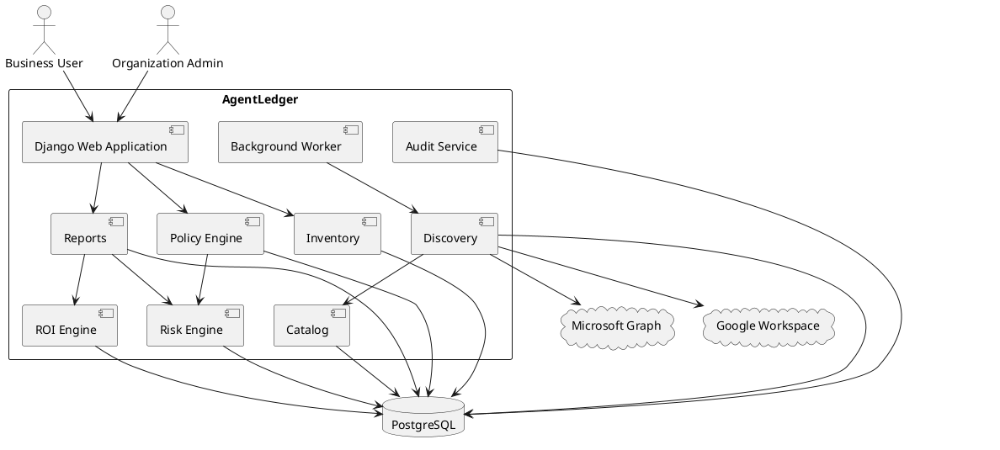
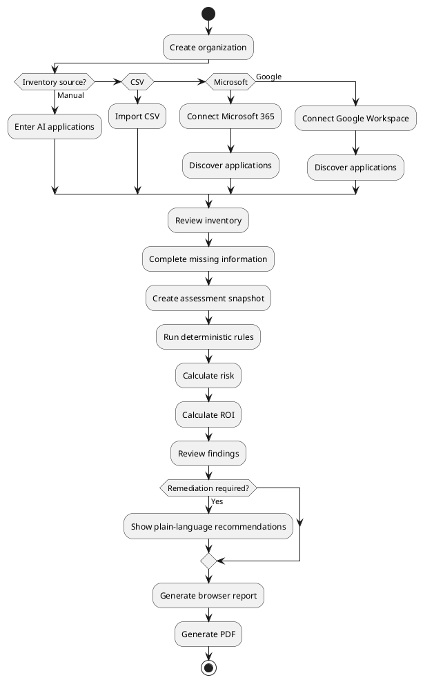

# SPEC-1-AgentLedger

**Version:** 1.8  
**Status:** Final hardened MVP architecture baseline after adversarial review closure  
**Primary change from v1.7:** Resolves the remaining Merkle audit protocol, identifier canonicalization, encryption-key lifecycle, isolated Chromium rendering, and forward-compatible deployment/rollback design; removes provisional architecture items and converts them into implementation/release gates.

## Background

Small and medium-sized professional-service firms are increasingly adopting AI assistants and autonomous agents across workflows involving email, documents, customer records, financial systems, internal operations, and third-party SaaS applications.

However, AI adoption is often happening faster than organizations can establish appropriate governance, visibility, approval controls, security policies, and audit trails.

This creates several operational problems:

- Organizations may not know which AI agents or AI-enabled applications are being used.
- AI applications may have excessive access to sensitive systems or data.
- Risky actions may occur without human approval.
- Businesses may lack sufficient audit evidence for customers, regulators, insurers, or internal reviews.
- Management often cannot determine whether individual AI tools are producing measurable financial value.

AgentLedger will provide a centralized governance, monitoring, risk-assessment, approval, and ROI layer for AI usage within small and medium-sized professional-service organizations.

The initial market is:

1. Accounting and bookkeeping
2. Legal services
3. Marketing and professional agencies
4. Construction and contracting
5. Healthcare practices

Accounting and bookkeeping will be the primary beachhead market.

The project is being developed under the following founder constraints:

- Single technical founder
- Founder develops the application personally
- No employees
- No outside funding
- No starting capital
- Existing self-hosted WSL2 server available
- Infrastructure should initially fit within free or near-zero-cost resources
- Architecture must remain portable to normal Linux/VPS/cloud infrastructure

AgentLedger will therefore begin as a small but genuine SaaS product rather than a broad enterprise AI-governance platform.

The initial product will focus on:

```text
AI Inventory
     ↓
Risk Assessment
     ↓
ROI Assessment
     ↓
Professional Report
     ↓
Continuous Discovery
     ↓
Continuous Monitoring
     ↓
Automated Governance
```

The first commercially sellable product ends at the professional-report stage.

Microsoft 365 and Google Workspace discovery will subsequently reduce manual work and create the foundation for recurring monitoring.

The product must answer five questions clearly:

```text
1. What AI tools are we using?

2. What data and systems can they access?

3. What risks does that access create?

4. Where should humans remain in control?

5. Are these AI tools generating enough value
   to justify their cost?
```

A central design principle is:

```text
Deterministic core.
AI-assisted edges.
```

A second design principle is:

```text
Security boundary first.
Convenience second.
```

A third design principle is:

```text
Zero-onboarding surface.
Deep technical controls underneath.
```

Risk scoring, policy evaluation, financial calculations, approval requirements, and compliance results must remain reproducible and explainable.

Probabilistic AI may assist with unstructured input, but must not independently determine authoritative assessment results.

---

## Requirements

### Must Have

#### Inventory

The system must support:

- Manual AI inventory creation
- CSV import
- Microsoft 365 discovery
- Google Workspace discovery
- A common canonical inventory model regardless of data source

Every inventory item must support:

```text
AI application or agent
Vendor
Business owner
Department
Users
Business purpose
Subscription cost
Connected systems
Data categories
Permissions
Autonomy level
Human approval requirements
Operational status
Discovery source
Evidence
```

Automatically discovered information must never silently overwrite manually confirmed information.

Conflicts must be presented for reconciliation.

---

### Deterministic Assessment

Risk assessment must be reproducible.

Given identical:

```text
Inventory snapshot
Organization configuration
Ruleset versions
Assessment context
Engine version
```

the system must produce identical business results.

Risk dimensions include:

```text
Data sensitivity
System privilege
External connectivity
Agent autonomy
Financial impact
Human oversight
Vendor risk
Regulatory relevance
```

Every score must explain its contributing factors.

---

### Policy Engine

AgentLedger must support:

```text
Platform Rules
Industry Rules
Organization Rules
Platform Recommendations
```

Rule precedence:

```text
Mandatory Platform Rule
        ↓
Industry Rule
        ↓
Organization Rule
        ↓
Platform Recommendation
```

Organizations may make controls stricter.

Organizations may not weaken mandatory platform controls unless the platform explicitly marks the control as overridable.

Policy evaluation results:

```text
PASS
FAIL
WARNING
NOT_APPLICABLE
```

Each result must contain:

```text
Rule ID
Rule version
Evidence
Result
Explanation
Severity
Recommended remediation
```

---

### Visual Rule Builder

Users must not need to understand programming syntax.

Rules will appear as sentence-like controls:

```text
WHEN

[ Data accessed ▼ ]
[ contains     ▼ ]
[ Payroll      ▼ ]

AND

[ AI can       ▼ ]
[ Send data externally ▼ ]

THEN

[ Risk level ▼ ]
[ High       ▼ ]

AND

[ Require control ▼ ]
[ Human approval  ▼ ]
```

Internally, the rule becomes structured JSON.

Example:

```json
{
  "all": [
    {
      "field": "data_categories",
      "operator": "contains",
      "value": "payroll"
    },
    {
      "field": "capabilities",
      "operator": "contains",
      "value": "external_transfer"
    }
  ],
  "effects": [
    {
      "type": "risk_points",
      "dimension": "data_sensitivity",
      "value": 25
    },
    {
      "type": "require_control",
      "control": "human_approval"
    }
  ]
}
```

No customer-supplied executable code is permitted.

Specifically:

```text
No eval()
No Python
No JavaScript execution
No SQL expressions
No customer executable DSL
```

---

### ROI Engine

ROI calculations must remain deterministic.

Inputs may include:

```text
Monthly subscription cost
Implementation cost
Hours saved
Loaded labor cost
Additional revenue
Avoided operational cost
```

Every assumption must be labeled:

```text
Measured
Customer supplied
Estimated
Unknown
```

Calculations must expose their arithmetic.

---

### Reporting

Reports must include:

```text
Executive Summary
AI Inventory
Overall Risk
Individual Tool Risk
Policy Findings
Recommendations
AI Expenditure
ROI
Methodology
Evidence
Assessment Date
Ruleset Versions
Report Identifier
```

Reports must be available in-browser and as PDF.

---

### Identity and Tenant Bootstrap

AgentLedger must distinguish between:

```text
Identity / Control Plane
=
Which organizations may this authenticated user enter?

Tenant Data Plane
=
Which rows may the selected organization access?
```

The application must be able to establish an authenticated user context before an organization context exists.

Control-plane tables include:

```text
users
organizations
organization_members
```

Tenant business tables include:

```text
inventory
assessments
rules
reports
discoveries
ROI records
findings
audit records
```

Organization membership must be verified before a normal request is allowed to establish `app.current_organization_id`.

---

### Tenant Isolation

Tenant isolation must be enforced at the PostgreSQL database layer using Row-Level Security (RLS), not solely by Django queryset filtering.

Requirements:

```text
Every tenant-owned table carries organization_id.

PostgreSQL RLS is ENABLED and FORCED.

Normal web and worker roles:
- are not superusers
- do not have BYPASSRLS
- do not own tenant tables

Tenant context is transaction-local.

Application-level organization filters remain
for clarity, query efficiency, and defense in depth,
but are not the authoritative security boundary.
```

The expected invariant is:

```text
Application code decides
WHICH organization the authenticated user belongs to.

PostgreSQL decides
WHICH rows that organization may access or modify.
```

Missing tenant context must fail closed.

Cross-tenant reads, writes, raw SQL access, and direct primary-key lookups must be covered by automated release-gate tests.

---

### Zero-Onboarding Interface

The primary client-facing experience must be understandable without technical training.

Normal customer-facing views must avoid exposing:

```text
UUIDs
OAuth Client IDs
Raw permission scope strings
Database identifiers
Queue/job identifiers
Infrastructure logs
Cryptographic implementation details
```

Instead, the system must translate technical facts into business meaning.

Example:

```text
Technical:
Files.ReadWrite.All

Customer-facing:
This software can read and change company files.
```

Financial calculations must show traceable arithmetic.

Example:

```text
12 hours saved
× $45 per hour
= $540 labor value

$540 labor value
- $50 software cost
= $490 monthly net value
```

Import, discovery, and reconciliation workflows must use explicit step-by-step confirmation screens.

The interface must never require customers to perform manual arithmetic or interpret raw security identifiers.

---

### Auditability

Important events must be recorded:

```text
Inventory creation
Inventory modification
Discovery
Reconciliation
Rule creation
Rule modification
Assessment
Report generation
Connector connection
Connector disconnection
```

Historical assessments must remain reproducible.

---

### Infrastructure

The application must:

- Run initially on the existing WSL2 infrastructure
- Use containers
- Remain portable to ordinary Linux infrastructure
- Avoid mandatory paid APIs
- Allow a complete assessment using zero LLM calls

---

### Should Have

The system should support:

- Scheduled reassessment
- Risk posture over time
- Organization-specific risk thresholds
- Organization-specific financial assumptions
- Export of inventory and assessment data
- Evidence-backed discovery
- Microsoft 365 discovery
- Google Workspace discovery
- Catalog-based deterministic application matching

---

### Could Have

Future capabilities may include:

```text
QuickBooks integration
Xero integration
Practice-management integrations
Browser-based SaaS discovery
Automated policy-document extraction
AI-assisted unknown-product research
Legal industry policy pack
Agency policy pack
Construction policy pack
Healthcare policy pack
Action interception
Automated approval workflows
```

---

### Will Not Have in Initial MVP

```text
Real-time AI action interception
Endpoint monitoring
SIEM replacement
Network traffic inspection
Autonomous permission modification
Custom ML model training
LLM-generated authoritative risk scores
Kubernetes
Microservice architecture
```

---

### Determinism Principle

The required processing model is:

```text
Unstructured Input
        ↓
Optional AI Extraction
        ↓
Validated Structured Data
        ↓
Deterministic Rules Engine
        ↓
Deterministic Risk / ROI Calculation
        ↓
Explainable Result
```

Probabilistic systems must not directly determine:

```text
Risk score
Compliance status
Policy result
Approval requirement
ROI
Enforcement decision
```

---

## Method

### Architecture

AgentLedger will begin as a modular monolith.



Initial stack:

```text
Python 3.14
Django 5.2 LTS
PostgreSQL 18
Gunicorn
Caddy
Docker Compose
Server-rendered Django templates
Vanilla JavaScript where required
Playwright/Chromium PDF generation
```

Avoid initially:

```text
React SPA
Node application backend
Redis
Celery
RabbitMQ
Kafka
Elasticsearch
Kubernetes
Microservices
```

---

### Application Structure

```text
agentledger/
├── accounts/
├── organizations/
├── inventory/
├── catalog/
├── connectors/
├── discovery/
├── policies/
├── risk/
├── roi/
├── reports/
├── audit/
└── jobs/
```

Modules communicate through Python interfaces rather than network APIs.

---

### Canonical Inventory

All inventory paths converge:

```text
Manual Entry ─────┐
                  │
CSV Import ───────┤
                  ▼
Microsoft ──► Normalization ──► InventoryItem
                  ▲
Google ───────────┘
```

---

### Core Database Schema

#### organizations

```text
id                  UUID PK
name                VARCHAR(255)
industry            VARCHAR(50)
timezone            VARCHAR(64)
created_at          TIMESTAMP
updated_at          TIMESTAMP
```

#### organization_members

```text
id                  UUID PK
organization_id     UUID FK
user_id             UUID FK
role                ENUM(owner, admin, assessor, viewer)
created_at          TIMESTAMP

UNIQUE(organization_id, user_id)
```

#### vendors

```text
id                  UUID PK
name                VARCHAR(255)
website_domain      VARCHAR(255)
status              ENUM(verified, unverified)
created_at          TIMESTAMP
updated_at          TIMESTAMP
```

#### products

```text
id                   UUID PK
vendor_id            UUID FK
name                 VARCHAR(255)
category             VARCHAR(100)
is_ai_product        BOOLEAN
default_risk_profile JSONB
catalog_version      INTEGER
created_at           TIMESTAMP
updated_at           TIMESTAMP
```

#### product_identifiers

```text
id                  UUID PK
product_id          UUID FK
identifier_type     VARCHAR(50)
identifier_value    VARCHAR(512)
```

Possible identifier types:

```text
microsoft_app_id
google_client_id
oauth_domain
domain
product_name
```

---

### Inventory Items

```text
id                    UUID PK
organization_id       UUID FK
product_id            UUID FK NULL
display_name          VARCHAR(255)
vendor_name           VARCHAR(255)
business_owner        VARCHAR(255)
department            VARCHAR(255)
business_purpose      TEXT
status                ENUM(active, trial, inactive, reviewing)
monthly_cost_cents    INTEGER
seat_count            INTEGER
autonomy_level        SMALLINT
source_type           ENUM(manual, csv, discovered)
created_at            TIMESTAMP
updated_at            TIMESTAMP
```

Autonomy:

```text
0 = No autonomous actions
1 = Suggests actions
2 = Acts after human approval
3 = Performs limited actions automatically
4 = Performs significant actions automatically
```

The UI displays plain-language descriptions instead of numeric values.

---

### Data Categories

Initial platform categories:

```text
Public information
Internal business information
Client information
Financial records
Banking information
Payroll
Tax records
Health information
Legal information
Authentication credentials
Personally identifiable information
```

Association:

```text
inventory_item_id
data_category_id
access_level
```

Access levels:

```text
unknown
read
write
delete
transmit
```

---

### Connected Systems

Examples:

```text
QuickBooks
Xero
Microsoft Outlook
Gmail
Google Drive
SharePoint
OneDrive
Payroll
Banking
CRM
Practice Management
```

Connection records:

```text
id
organization_id
inventory_item_id
connected_system_id
access_level
evidence_id
```

---

### Connector Interface

Every connector implements the same conceptual interface:

```python
class DiscoveryConnector:
    def authorize(self, ...):
        ...

    def test_connection(self, ...):
        ...

    def discover(self, ...):
        ...

    def normalize(self, ...):
        ...

    def disconnect(self, ...):
        ...
```

Normalized output:

```text
Provider API
    ↓
DiscoveryArtifact
    ↓
Catalog Matcher
    ↓
Known Product / Unknown Product
    ↓
Review Queue
    ↓
Inventory
```

---

### Deterministic Product Matching

Application discovery must not depend on an LLM deciding whether something appears to be AI.

Matching order:

```text
1. Provider application/client ID
2. Verified domain
3. OAuth identifier
4. Exact normalized product name
5. Unknown
```

Unknown applications enter review.

Once resolved, the deterministic product catalog can be updated.

```text
External Application
        ↓
Normalize Identifiers
        ↓
Exact Match?
    ┌───┴────┐
   YES       NO
    │         │
Known AI   Review Queue
    │         │
    └────┬────┘
         ↓
     Inventory
```

---

### Discovery Evidence

#### discovery_runs

```text
id
organization_id
connector_id
started_at
completed_at
status
cursor
error_code
```

#### discovery_artifacts

```text
id
organization_id
discovery_run_id
external_id
artifact_type
normalized_name
raw_payload JSONB
discovered_at
```

#### evidence

```text
id
organization_id
source_type
source_id
observed_at
payload_hash
summary
```

Original provider evidence must remain distinguishable from AgentLedger interpretation.

---

### Reconciliation

Discovery does not overwrite manually confirmed values.

Example:

```text
Current record:

Monthly cost = $150


Discovered:

Users = 7


Result:

Monthly cost remains $150.
User evidence is updated.
```

Conflict UI:

```text
We found a difference.

AgentLedger currently says:
Users: 4

Microsoft 365 found:
Users: 7

[ Keep 4 ]     [ Use 7 ]

[ Why am I seeing this? ]
```

---

### Policy Evaluation

Rules are pure deterministic functions.

```python
result = evaluate_rule(
    context=assessment_context,
    rule=rule_definition,
)
```

The evaluator must not:

```text
Call APIs
Call LLMs
Read environment-dependent state
Modify the database
Depend on current time implicitly
```

Time-dependent facts must be supplied explicitly as context.

---

### Risk Calculation

Dimensions:

```text
Data Sensitivity
System Privilege
External Connectivity
Autonomy
Financial Impact
Human Oversight
Vendor Risk
Regulatory Relevance
```

Each dimension:

```text
0 <= score <= 100
```

Example weighting:

```text
Data sensitivity         20%
System privilege         20%
Autonomy                 15%
External connectivity    15%
Human oversight          10%
Financial impact         10%
Regulatory relevance      5%
Vendor risk               5%
                         ----
                         100%
```

Overall severity:

```text
0–24     Low
25–49    Moderate
50–74    High
75–100   Critical
```

Mandatory rules may establish minimum severity floors.

Example:

```text
Can initiate bank payment
+
No human approval
=
Minimum severity: CRITICAL
```

Risk explanation:

```text
Risk: 72 — HIGH

+25 Payroll data
+20 Write access
+15 External transmission
+20 Autonomous action
-8  Human approval control
```

---

### ROI Calculation

Conceptually:

```text
monthly_labor_value =
    hours_saved_per_month
    × loaded_hourly_rate
```

```text
monthly_value =
    monthly_labor_value
    + attributable_revenue
    + avoided_monthly_cost
```

```text
monthly_net_value =
    monthly_value
    - monthly_subscription_cost
    - amortized_implementation_cost
```

```text
roi_percent =
    monthly_net_value
    ÷ monthly_total_cost
    × 100
```

The user must always be able to inspect the underlying arithmetic.

---

### Assessment Snapshots

Each assessment captures:

```text
Inventory snapshot
Evidence references
Platform ruleset version
Industry ruleset version
Organization rule versions
Scoring configuration
ROI inputs
Engine version
Timestamp
Results
```

Hash:

```text
assessment_input_hash =
SHA-256(canonical assessment input)
```

This ensures historical reports remain reproducible.

---

### Reporting Pipeline

```text
Assessment Snapshot
        ↓
Report Context
        ↓
Django HTML Template
       ↙       ↘
Browser       Chromium
Report           ↓
               PDF
```

HTML is the canonical report implementation.

PDF rendering uses the same content.

---

### Background Jobs

AgentLedger initially uses PostgreSQL rather than Redis.

The `background_jobs` table remains the durable queue.

Workers are event-driven through PostgreSQL `LISTEN/NOTIFY`, but still claim work transactionally with `SELECT ... FOR UPDATE SKIP LOCKED`.

```text
id
organization_id
job_type
payload JSONB
status
priority
attempts
available_at
locked_at
locked_by
last_error
created_at
completed_at
```

Initial job types:

```text
microsoft_discovery
google_discovery
risk_reassessment
report_generation
catalog_refresh
audit_batch_seal
```

Retry strategy:

```text
Attempt 1: immediate
Attempt 2: +1 minute
Attempt 3: +5 minutes
Attempt 4: +30 minutes
Attempt 5: failed
```


---

### Event-Driven Durable Background Jobs

AgentLedger uses:

```text
PostgreSQL durable queue
        +
LISTEN / NOTIFY wake-up signal
        +
SELECT ... FOR UPDATE SKIP LOCKED
        +
job leases / fencing tokens
        +
periodic recovery scan
```

The invariant is:

```text
NOTIFY tells workers to look.

background_jobs tells workers what exists.

SKIP LOCKED decides which worker initially owns the job.

claim_token proves which worker still owns the job.

lock_expires_at permits abandoned-job recovery.

RLS controls tenant business data.
```

`LISTEN/NOTIFY` is an optimization, not the queue.

Notifications contain job identifiers only. Business payloads remain in `background_jobs`.

#### Queue Schema

```text
id                 UUID PK
organization_id    UUID
job_type            VARCHAR
payload             JSONB
status              ENUM(queued, running, completed, failed)
priority            INTEGER
attempts            INTEGER
available_at        TIMESTAMP
locked_at           TIMESTAMP NULL
lock_expires_at     TIMESTAMP NULL
locked_by           VARCHAR NULL
claim_token         UUID NULL
error_code          VARCHAR NULL
safe_error_summary  TEXT NULL
error_fingerprint   VARCHAR NULL
created_at          TIMESTAMP
completed_at        TIMESTAMP NULL
```

#### Dedicated Psycopg 3 Listener

The listener uses a dedicated Psycopg 3 connection.

It does not use:

```text
psycopg2
conn.poll()
mutable conn.notifies queues
Django's normal request ORM connection
```

Reference implementation:

```python
import logging
import time
from uuid import UUID

import psycopg


logger = logging.getLogger(__name__)


class EventDrivenJobListener:
    CHANNEL = "agentledger_job_channel"

    def __init__(
        self,
        worker_id: UUID,
        listener_dsn: str,
        recovery_interval_seconds: int = 30,
    ):
        self.worker_id = str(worker_id)
        self.listener_dsn = listener_dsn
        self.recovery_interval_seconds = recovery_interval_seconds

    def run(self, drain_queue) -> None:
        while True:
            try:
                with psycopg.connect(
                    self.listener_dsn,
                    autocommit=True,
                ) as conn:

                    conn.execute(
                        f"LISTEN {self.CHANNEL}"
                    )

                    # Reconcile durable state after LISTEN is established.
                    drain_queue(self.worker_id)

                    while True:
                        for _notification in conn.notifies(
                            timeout=self.recovery_interval_seconds,
                            stop_after=1,
                        ):
                            pass

                        # Executes after a notification or timeout.
                        drain_queue(self.worker_id)

            except psycopg.OperationalError:
                logger.exception(
                    "Job listener connection lost"
                )
                time.sleep(5)
```

The listener order is mandatory:

```text
LISTEN
   ↓
initial durable queue scan
   ↓
notifications
   ↓
periodic recovery scans
```

This protects against startup races, missed notifications, reconnects, and scheduled jobs becoming eligible without a fresh notification.

#### Notification Trigger

```sql
CREATE OR REPLACE FUNCTION notify_agentledger_job()
RETURNS TRIGGER
LANGUAGE plpgsql
AS $$
BEGIN
    PERFORM pg_notify(
        'agentledger_job_channel',
        NEW.id::text
    );

    RETURN NEW;
END;
$$;
```

New jobs wake listeners:

```sql
CREATE TRIGGER trg_job_insert_notify
AFTER INSERT
ON background_jobs
FOR EACH ROW
EXECUTE FUNCTION notify_agentledger_job();
```

A requeued job may also emit a notification when it becomes immediately eligible.

Notifications do not carry credentials or business payloads.

#### Atomic Claim and Lease

Claiming is short and transactional.

```python
from dataclasses import dataclass
from datetime import timedelta
from uuid import UUID, uuid4

from django.db import transaction
from django.utils import timezone

from agentledger.jobs.models import BackgroundJob


JOB_LEASE = timedelta(minutes=10)


@dataclass(frozen=True)
class ClaimedJob:
    id: UUID
    organization_id: UUID
    job_type: str
    payload: dict
    attempts: int
    claim_token: UUID


@transaction.atomic
def claim_next_job(worker_id: str) -> ClaimedJob | None:
    now = timezone.now()

    job = (
        BackgroundJob.objects
        .select_for_update(skip_locked=True)
        .filter(
            status="queued",
            available_at__lte=now,
        )
        .order_by(
            "priority",
            "available_at",
            "id",
        )
        .first()
    )

    if job is None:
        return None

    claim_token = uuid4()

    job.status = "running"
    job.locked_by = worker_id
    job.locked_at = now
    job.lock_expires_at = now + JOB_LEASE
    job.claim_token = claim_token
    job.attempts += 1

    job.save(
        update_fields=[
            "status",
            "locked_by",
            "locked_at",
            "lock_expires_at",
            "claim_token",
            "attempts",
        ]
    )

    return ClaimedJob(
        id=job.id,
        organization_id=job.organization_id,
        job_type=job.job_type,
        payload=job.payload,
        attempts=job.attempts,
        claim_token=claim_token,
    )
```

The queue lock is released before external work begins.

#### Fencing Token

Every completion, failure, heartbeat, or lease extension must match:

```text
job_id
worker_id
claim_token
status = running
```

Example completion:

```python
updated = (
    BackgroundJob.objects
    .filter(
        id=job.id,
        status="running",
        locked_by=worker_id,
        claim_token=job.claim_token,
    )
    .update(
        status="completed",
        completed_at=timezone.now(),
        locked_at=None,
        lock_expires_at=None,
    )
)

if updated != 1:
    raise LostJobLease(job.id)
```

A worker whose lease has expired can no longer finalize a job reclaimed by another worker.

#### Fenced Failure Handling

Completion, failure, retry, and heartbeat transitions are all fenced.

The retry schedule must be derived from the currently fenced database row.

Do not trust a caller-supplied:

```text
attempts
```

integer to choose retry timing.

Reference implementation:

```python
from datetime import timedelta
from uuid import UUID

from django.db import transaction
from django.utils import timezone

from agentledger.jobs.models import BackgroundJob


class LostJobLease(Exception):
    pass


RETRY_DELAYS = {
    1: timedelta(minutes=1),
    2: timedelta(minutes=5),
    3: timedelta(minutes=30),
    4: timedelta(hours=2),
}


def fail_job_with_fence(
    *,
    job_id: UUID,
    worker_id: str,
    claim_token: UUID,
    error_code: str,
    safe_summary: str,
    fingerprint: str,
    using: str = "default",
) -> None:

    with transaction.atomic(using=using):
        job = (
            BackgroundJob.objects
            .using(using)
            .select_for_update()
            .filter(
                id=job_id,
                status="running",
                locked_by=worker_id,
                claim_token=claim_token,
            )
            .first()
        )

        if job is None:
            raise LostJobLease(job_id)

        now = timezone.now()

        if job.attempts >= 5:
            job.status = "failed"
            job.completed_at = now
            job.available_at = now
        else:
            job.status = "queued"
            job.available_at = (
                now + RETRY_DELAYS[job.attempts]
            )
            job.completed_at = None

        job.locked_at = None
        job.lock_expires_at = None
        job.locked_by = None
        job.claim_token = None
        job.error_code = error_code
        job.safe_error_summary = safe_summary
        job.error_fingerprint = fingerprint

        job.save(
            using=using,
            update_fields=[
                "status",
                "available_at",
                "completed_at",
                "locked_at",
                "lock_expires_at",
                "locked_by",
                "claim_token",
                "error_code",
                "safe_error_summary",
                "error_fingerprint",
            ],
        )
```

Why lock the queue row again?

```text
failure handling is short
+
the row lock guarantees attempts and
fencing ownership are evaluated atomically
+
retry timing comes from authoritative state
```

An unfenced failure write remains prohibited.

#### Lease Recovery

Recovery scans include:

```text
status = running
AND
lock_expires_at < now()
```

Expired jobs are atomically returned to the queue unless their retry budget is exhausted.

Long operations renew their lease using the same fencing tuple.

#### Deterministic Retry Policy

```python
from datetime import timedelta


RETRY_DELAYS = {
    1: timedelta(minutes=1),
    2: timedelta(minutes=5),
    3: timedelta(minutes=30),
    4: timedelta(hours=2),
}
```

Attempt 5 becomes `failed` unless manually retried.

Provider-specific rate-limit information may increase a delay but never reduce it below the local safety policy.

#### Safe Errors

Do not persist arbitrary:

```python
str(exception)
```

into customer-visible queue state.

Persist:

```text
error_code
safe_error_summary
error_fingerprint
```

Detailed logs must apply secret/token redaction.

#### Short Tenant Transactions

A background network call must not hold one PostgreSQL tenant transaction open for its entire duration.

Handlers use three phases:

```text
PREPARE
tenant transaction
→ load required tenant state / credential material
→ close transaction

EXECUTE
no ORM transaction
→ call Microsoft / Google / renderer
→ produce immutable result object

PERSIST
tenant transaction
→ store normalized result / evidence
→ close transaction
```

Reference contract:

```python
class JobHandler:
    def prepare(self, job):
        ...

    def execute_external(self, prepared):
        ...

    def persist(self, job, result):
        ...
```

Dispatcher:

```python
def execute_claimed_job(job, worker_id):
    handler = resolve_handler(job.job_type)

    with tenant_transaction(job.organization_id):
        prepared = handler.prepare(job)

    result = handler.execute_external(prepared)

    with tenant_transaction(job.organization_id):
        handler.persist(job, result)

    complete_job_with_fence(
        job=job,
        worker_id=worker_id,
    )
```

If external work is long-running, the handler receives a lease-heartbeat callback that updates the queue using the fencing token without opening tenant business access.

This prevents:

```text
long-lived database snapshots
network calls inside tenant transactions
unnecessary transaction-held resources
```

while retaining RLS for all customer-data reads and writes.

#### Concurrent Index Migrations

RLS policy installation remains transactional.

Concurrent index creation uses a separate non-atomic migration:

```python
from django.contrib.postgres.operations import AddIndexConcurrently
from django.db import migrations, models


class Migration(migrations.Migration):
    atomic = False

    dependencies = [
        ("audit", "0002_enable_rls"),
    ]

    operations = [
        AddIndexConcurrently(
            model_name="audittrail",
            index=models.Index(
                fields=[
                    "organization",
                    "event_type",
                    "occurred_at",
                ],
                name="idx_audit_tenant_event_time",
            ),
        ),
    ]
```

Do not use migration router `hints` as a substitute for `Migration.atomic = False`.

---

### Audit Trail

```text
id
organization_id
actor_user_id
event_type
entity_type
entity_id
occurred_at
data JSONB
previous_hash
event_hash
```

Hash chain:

```text
event_hash =
SHA-256(
    canonical_event_data
    + previous_hash
)
```

Important events:

```text
inventory.created
inventory.changed
discovery.completed
reconciliation.accepted
rule.created
rule.changed
assessment.completed
report.generated
connector.connected
connector.disconnected
```

---

### Identity / Control Plane RLS

Tenant business RLS cannot require `current_organization_id` before the application has determined which organizations the authenticated user is permitted to enter.

AgentLedger therefore uses two transaction-local security contexts:

```text
app.current_user_id
app.current_organization_id
```

#### User Context Resolver

```sql
CREATE OR REPLACE FUNCTION
app_private.current_user_id()
RETURNS UUID
LANGUAGE plpgsql
STABLE
AS $$
DECLARE
    user_value TEXT;
BEGIN
    user_value :=
        current_setting(
            'app.current_user_id',
            true
        );

    IF user_value IS NULL
       OR user_value = '' THEN
        RAISE EXCEPTION
            'Authenticated user context is not set'
            USING ERRCODE = '42501';
    END IF;

    RETURN user_value::UUID;
END;
$$;
```

#### Optional Organization Context

Control-plane policies occasionally need to operate both before and after tenant selection.

Use a nullable resolver for those policies only:

```sql
CREATE OR REPLACE FUNCTION
app_private.current_organization_id_or_null()
RETURNS UUID
LANGUAGE sql
STABLE
AS $$
    SELECT NULLIF(
        current_setting(
            'app.current_organization_id',
            true
        ),
        ''
    )::UUID;
$$;
```

Tenant business tables continue to use the fail-closed `current_organization_id()` function.

#### Membership Bootstrap

Before tenant selection, the runtime web role may read only the authenticated user's own membership rows:

```sql
CREATE POLICY membership_self_bootstrap
ON organization_members
FOR SELECT
TO agentledger_app
USING (
    user_id =
    app_private.current_user_id()
);
```

The broad v1.4 concept:

```text
membership_selected_tenant
```

is removed from the normal web role.

Reason:

```text
If every tenant member can raw-query all membership rows
after selecting an organization,
RLS may expose coworker membership metadata
even when the application role is only Viewer.
```

Role-level membership administration is a separate authorization problem.

For the pilot MVP:

```text
normal user
→ may read their own membership rows

Owner/Admin membership administration
→ implemented later through a narrowly scoped
  database function or explicitly reviewed policy
```

Do not use an application-set string such as:

```text
app.current_role = owner
```

as an authoritative database privilege signal.

The database must derive any future elevated member-management permission from stored membership state, not trust a role value supplied by application code.

#### Organization Discovery

Users may view organizations for which their own membership is visible:

```sql
CREATE POLICY organizations_member_read
ON organizations
FOR SELECT
TO agentledger_app
USING (
    EXISTS (
        SELECT 1
        FROM organization_members AS membership
        WHERE
            membership.organization_id =
                organizations.id
        AND
            membership.user_id =
                app_private.current_user_id()
    )
);
```

#### Request Bootstrap

```text
Authenticate Django user
        ↓
BEGIN
        ↓
SET LOCAL current_user_id
        ↓
read permitted memberships
        ↓
resolve requested organization
        ↓
verify membership
        ↓
SET LOCAL current_organization_id
        ↓
tenant business queries
        ↓
COMMIT / ROLLBACK
```

A normal request may not set organization context from an arbitrary URL, cookie, POST value, or session value until membership has been verified under user context.

#### Organization Creation — Pilot Model

AgentLedger remains invite-only during the initial commercial pilot.

Therefore self-service organization creation is **not** exposed through `agentledger_app` in v1.5.

Pilot workflow:

```text
Founder / trusted provisioning command
        ↓
agentledger_owner connection
        ↓
create organization
        ↓
create initial Owner membership
        ↓
invite user
```

The normal web runtime role cannot create arbitrary organizations.

This deliberately avoids introducing a privileged `SECURITY DEFINER` bootstrap function before public self-service onboarding is commercially necessary.

When public onboarding is later implemented, organization creation must be designed as a separately reviewed privileged operation.


---

### Tenant Isolation — PostgreSQL RLS

Application-level queryset scoping remains useful, but it is not the primary tenant security boundary.

The authoritative boundary is PostgreSQL Row-Level Security.

Security flow:

```text
Authenticated User
        ↓
Verified Organization Membership
        ↓
Explicit Database Transaction
        ↓
Transaction-Local Tenant Context
        ↓
PostgreSQL Row-Level Security
        ↓
Tenant-Owned Rows
```

The invariant is:

```text
Even if application code forgets:

WHERE organization_id = ...

PostgreSQL still prevents
cross-organization access.
```

#### Tenant-Owned Tables

Every tenant-owned table must contain:

```text
organization_id UUID NOT NULL
```

Examples include:

```text
inventory_items
inventory_connections
discovery_runs
discovery_artifacts
evidence
organization_rules
assessments
assessment_snapshots
reports
audit_events
roi_records
findings
```

Each tenant-owned table receives:

```sql
ALTER TABLE inventory_items
    ENABLE ROW LEVEL SECURITY;

ALTER TABLE inventory_items
    FORCE ROW LEVEL SECURITY;
```

and a policy equivalent to:

```sql
CREATE POLICY inventory_items_tenant_policy
ON inventory_items
FOR ALL
TO agentledger_app, agentledger_worker
USING (
    organization_id =
    app_private.current_organization_id()
)
WITH CHECK (
    organization_id =
    app_private.current_organization_id()
);
```

`USING` protects reads and existing rows.

`WITH CHECK` prevents a tenant-scoped transaction from inserting or moving a row into another tenant.

#### Fail-Closed Tenant Context

Create a PostgreSQL helper function:

```sql
CREATE SCHEMA IF NOT EXISTS app_private;

CREATE OR REPLACE FUNCTION
app_private.current_organization_id()
RETURNS UUID
LANGUAGE plpgsql
STABLE
AS $$
DECLARE
    tenant_value TEXT;
BEGIN
    tenant_value :=
        current_setting(
            'app.current_organization_id',
            true
        );

    IF tenant_value IS NULL
       OR tenant_value = '' THEN
        RAISE EXCEPTION
            'AgentLedger tenant context is not set'
            USING ERRCODE = '42501';
    END IF;

    RETURN tenant_value::UUID;
END;
$$;
```

Missing context therefore fails closed.

#### Runtime Database Roles

Production must not run normal application traffic as:

```text
postgres
superuser
tenant-table owner
BYPASSRLS role
```

Use role separation:

```text
agentledger_owner
    ├── owns schema and tables
    ├── executes migrations
    └── not used by normal application traffic

agentledger_app
    ├── web runtime
    ├── normal CRUD privileges
    ├── subject to RLS
    ├── NOSUPERUSER
    ├── NOBYPASSRLS
    └── does not own tenant tables

agentledger_worker
    ├── background task runtime
    ├── subject to tenant RLS
    ├── receives narrow queue privileges
    ├── NOSUPERUSER
    ├── NOBYPASSRLS
    └── does not own tenant tables
```

#### Transaction-Local Security Context

Do not use persistent session-level user or tenant settings.

Reference helpers:

```python
from contextlib import contextmanager

from django.db import connection, transaction


def set_local_context(name: str, value) -> None:
    with connection.cursor() as cursor:
        cursor.execute(
            "SELECT set_config(%s, %s, true)",
            [name, str(value)],
        )


@contextmanager
def identity_transaction(user_id):
    with transaction.atomic():
        set_local_context(
            "app.current_user_id",
            user_id,
        )
        yield


def activate_tenant(organization_id) -> None:
    set_local_context(
        "app.current_organization_id",
        organization_id,
    )


@contextmanager
def tenant_transaction(organization_id):
    with transaction.atomic():
        set_local_context(
            "app.current_organization_id",
            organization_id,
        )
        yield
```

Normal HTTP flow uses `identity_transaction()` first and calls `activate_tenant()` only after membership verification.

Worker data phases use `tenant_transaction()` because the queue already carries a previously validated organization identifier.

Transaction-local settings expire automatically at transaction completion.

#### Request Context

```text
HTTP Request
     ↓
Authenticate User
     ↓
BEGIN + user context
     ↓
Resolve authorized memberships
     ↓
Verify selected organization
     ↓
SET LOCAL tenant context
     ↓
Execute tenant application queries
     ↓
COMMIT / ROLLBACK
```

This explicitly resolves the tenant-bootstrap paradox.

#### Background Workers

Workers use the same tenant discipline.

A queued job carries:

```text
job_id
organization_id
job_type
payload
```

After claiming the system-level queue row:

```python
def execute_job(job):
    with tenant_transaction(job.organization_id):
        dispatch_job(job)
```

The worker may therefore discover jobs globally while still entering a tenant-scoped transaction before touching customer business data.

#### Queue Table Exception

The queue itself requires carefully scoped cross-tenant access for the worker.

Web role:

```sql
CREATE POLICY jobs_web_tenant_policy
ON background_jobs
FOR ALL
TO agentledger_app
USING (
    organization_id =
    app_private.current_organization_id()
)
WITH CHECK (
    organization_id =
    app_private.current_organization_id()
);
```

Worker role:

```sql
CREATE POLICY jobs_worker_queue_policy
ON background_jobs
FOR ALL
TO agentledger_worker
USING (true)
WITH CHECK (true);
```

This exception applies to the queue table only.

It does not grant unrestricted access to tenant business tables.

#### Application Filtering Still Remains

Application code should continue to express tenant intent:

```python
InventoryItem.objects.filter(
    organization=request.organization
)
```

This remains useful for readability, query planning, and defense in depth.

However:

```text
Application filter
=
clarity + efficiency + defense in depth

PostgreSQL RLS
=
authoritative security boundary
```

#### Raw SQL Protection

Inside an Organization A transaction:

```python
cursor.execute(
    "SELECT * FROM inventory_items"
)
```

must still be unable to return Organization B rows because PostgreSQL applies RLS independently of the ORM.

#### Write Protection

While tenant context is Organization A, this must fail:

```python
InventoryItem.objects.create(
    organization_id=organization_b.id,
    ...
)
```

Expected result:

```text
Current tenant:
Organization A

Attempted row:
Organization B

Result:
DATABASE REJECTION
```

#### RLS Migration Checklist

A tenant-table migration must perform:

```text
1. Add organization_id NOT NULL
2. Add tenant index
3. ENABLE ROW LEVEL SECURITY
4. FORCE ROW LEVEL SECURITY
5. Create USING policy
6. Create WITH CHECK policy
7. Grant runtime-role privileges
8. Verify runtime roles cannot bypass RLS
```

Example:

```sql
CREATE INDEX
idx_inventory_items_organization
ON inventory_items(organization_id);
```

Frequently queried tables may later receive compound indexes such as:

```sql
CREATE INDEX
idx_inventory_org_status
ON inventory_items(
    organization_id,
    status
);
```

#### Mandatory Tenant Security Tests

Release-gate tests must include:

```text
Tenant A context
→ unfiltered ORM query
→ Tenant B records absent
```

```text
Tenant A context
→ raw SQL SELECT *
→ Tenant B records absent
```

```text
Tenant A context
→ direct Tenant B primary-key lookup
→ inaccessible
```

```text
Tenant A context
→ attempt Tenant B update
→ no permitted modification
```

```text
Tenant A context
→ insert row for Tenant B
→ RLS violation
```

```text
Worker claims Tenant A job
→ Tenant A context established
→ Tenant B business rows inaccessible
```

```text
Missing tenant context
→ tenant-table query
→ denied / error
```

Runtime-role assertions must confirm:

```text
agentledger_app:
    NOSUPERUSER
    NOBYPASSRLS
    not tenant-table owner

agentledger_worker:
    NOSUPERUSER
    NOBYPASSRLS
    not tenant-table owner
```

---

### Build Phase 2A — Database-Enforced Tenant Isolation

Before storing real customer data, implement PostgreSQL RLS for every tenant-owned table.

Deliverables:

```text
Tenant organization_id columns and indexes
ENABLE ROW LEVEL SECURITY
FORCE ROW LEVEL SECURITY
Fail-closed current_organization_id() function
agentledger_owner database role
agentledger_app database role
agentledger_worker database role
Transaction-local tenant context helper
Tenant transaction middleware
Worker tenant execution wrapper
Queue-table worker exception policy
Raw SQL isolation tests
Cross-tenant write tests
Missing-context tests
Runtime-role privilege tests
```

This phase is a security release gate.

The application must not move into controlled external pilots until these tests pass.

---

### Tenancy Context Module Boundary

Tenant and identity context are authorization infrastructure.

They live under:

```text
agentledger/tenancy/context.py
```

The implementation must be database-alias aware because RLS context is connection-local.

The generic PostgreSQL setting writer is private and accepts only the two AgentLedger security contexts.

Reference:

```python
from contextlib import contextmanager
from typing import Any, Iterator
from uuid import UUID

from django.db import connections, transaction


USER_CONTEXT = "app.current_user_id"
TENANT_CONTEXT = "app.current_organization_id"

_ALLOWED_CONTEXTS = {
    USER_CONTEXT,
    TENANT_CONTEXT,
}


def _uuid_text(value: Any) -> str:
    return str(UUID(str(value)))


def _set_local_context(
    name: str,
    value: Any,
    *,
    using: str,
) -> None:
    if name not in _ALLOWED_CONTEXTS:
        raise ValueError(
            "Unsupported AgentLedger database context"
        )

    connection = connections[using]

    if not connection.in_atomic_block:
        raise RuntimeError(
            "Database security context must be set "
            "inside an explicit transaction."
        )

    with connection.cursor() as cursor:
        cursor.execute(
            "SELECT set_config(%s, %s, true)",
            [name, _uuid_text(value)],
        )


@contextmanager
def identity_transaction(
    user_id: Any,
    *,
    using: str = "default",
) -> Iterator[None]:
    with transaction.atomic(using=using):
        _set_local_context(
            USER_CONTEXT,
            user_id,
            using=using,
        )
        yield


def activate_tenant(
    organization_id: Any,
    *,
    using: str = "default",
) -> None:
    _set_local_context(
        TENANT_CONTEXT,
        organization_id,
        using=using,
    )


@contextmanager
def tenant_transaction(
    organization_id: Any,
    *,
    using: str = "default",
) -> Iterator[None]:
    with transaction.atomic(using=using):
        activate_tenant(
            organization_id,
            using=using,
        )
        yield
```

Security invariant:

```text
The cursor that executes customer queries
and the SET LOCAL tenant context
must use the same Django database alias
and therefore the same database session.
```

The codebase must never assume:

```text
tenant context on default
=
tenant context on app_runtime
```

because PostgreSQL session state is connection-local.

Queue fencing remains under:

```text
agentledger/jobs/leases.py
```

Cryptographic key handling remains under:

```text
agentledger/crypto/
```

---

### Credential Protection

OAuth credentials must be encrypted before database persistence using authenticated encryption.

Store:

```text
key_version
nonce
ciphertext
```

Master encryption material remains outside PostgreSQL and outside Git.

---

### Audit Integrity — Deterministic Merkle Sealing

AgentLedger uses asynchronous Merkle batches to make audit history tamper-evident without serializing normal user writes.

Normal audit-event insertion remains independent and fast:

```text
User Action
    ↓
Append Audit Event
    ↓
No synchronous chain-head mutation
    ↓
Background audit_batch_seal job
    ↓
Tenant Merkle block
```

#### Security Claim

The system describes this as:

```text
tamper-evident audit history
```

It must not claim:

```text
immutable
unmodifiable
impossible to alter
```

A sufficiently privileged database administrator could theoretically modify events and recompute a local chain. Stronger protection requires an external trust anchor.

#### Complete Event Envelope

Every Merkle leaf commits to the complete immutable audit envelope:

```json
{
  "schema_version": 1,
  "organization_id": "<uuid>",
  "event_id": "<uuid>",
  "occurred_at": "2026-09-02T10:26:14.123456Z",
  "actor_user_id": "<uuid-or-null>",
  "event_type": "inventory.updated",
  "entity_type": "inventory_item",
  "entity_id": "<uuid-or-null>",
  "data": {}
}
```

Changing any committed field changes the resulting root.

#### Canonical Serialization

Cryptographic JSON uses:

```text
RFC 8785
JSON Canonicalization Scheme
```

Reference dependency:

```text
rfc8785==0.1.4
```

Audit payloads must be representable inside the RFC 8785 / I-JSON constraints.

High-precision business numbers should be represented as decimal strings in cryptographically committed payloads rather than relying on binary floating-point representation.

Example:

```text
"monthly_cost": "49.00"
```

not:

```text
49.0000000001
```

#### Domain-Separated Hashes

```python
import hashlib
import rfc8785


def sha256(value: bytes) -> bytes:
    return hashlib.sha256(value).digest()


def hash_leaf(event: dict) -> bytes:
    return sha256(
        b"\x00" + rfc8785.dumps(event)
    )


def hash_node(
    left: bytes,
    right: bytes,
) -> bytes:
    return sha256(
        b"\x01" + left + right
    )


def hash_block(block: dict) -> bytes:
    return sha256(
        b"\x02" + rfc8785.dumps(block)
    )
```

Do not concatenate hexadecimal text representations when constructing parent hashes.

#### Merkle Tree Version

Initial algorithm identifier:

```text
AL-MERKLE-1
```

The tree uses a documented deterministic split algorithm based on largest power-of-two subtrees rather than an undocumented "duplicate odd final leaf" convention.

Changing tree shape or canonicalization creates a new algorithm version.

#### Deterministic Event Order

Events are ordered by:

```text
occurred_at ASC
id ASC
```

UUID is the deterministic tie-breaker.

#### Chain Head

Create:

```text
audit_chain_heads
```

Schema:

```text
organization_id UUID PRIMARY KEY
last_block_sequence BIGINT NOT NULL
last_block_hash CHAR(64) NULL
updated_at TIMESTAMPTZ NOT NULL
```

Only one audit sealer advances a given organization's chain at a time:

```text
BEGIN
    ↓
SELECT audit_chain_heads
FOR UPDATE
    ↓
select unsealed events
    ↓
build root
    ↓
insert block
    ↓
mark events sealed
    ↓
advance chain head
COMMIT
```

Different organizations may seal concurrently.

#### Audit Block

```text
audit_merkle_blocks

id UUID PK
organization_id UUID NOT NULL
block_sequence BIGINT NOT NULL
algorithm_version VARCHAR NOT NULL
canonicalization_version VARCHAR NOT NULL
event_count INTEGER NOT NULL
first_event_id UUID NOT NULL
last_event_id UUID NOT NULL
merkle_root CHAR(64) NOT NULL
previous_block_hash CHAR(64) NULL
block_hash CHAR(64) NOT NULL
sealed_at TIMESTAMPTZ NOT NULL

UNIQUE(
    organization_id,
    block_sequence
)
```

Block hash commits to:

```json
{
  "version": "AL-BLOCK-1",
  "organization_id": "<uuid>",
  "block_sequence": 42,
  "event_count": 153,
  "first_event_id": "<uuid>",
  "last_event_id": "<uuid>",
  "merkle_root": "<hex>",
  "previous_block_hash": "<hex-or-null>"
}
```

The next block references:

```text
previous_block_hash
=
previous block's block_hash
```

not merely its Merkle root.

#### Sealed Event Metadata

```text
node_hash CHAR(64) NULL
batch_block_id UUID NULL
batch_position INTEGER NULL
```

Runtime application roles cannot directly alter cryptographic sealing metadata.

#### Batch Size

Initial maximum:

```text
1,000 events per organization per block
```

Rows arriving after the transaction snapshot enter the next block.

#### Verification

Verifier result:

```text
VALID
INVALID
INCOMPLETE
```

Verification recalculates:

```text
event envelopes
leaf hashes
Merkle root
block hash
previous-block links
```

No LLM or external service is required.

#### External Anchoring — Later Optional Layer

A future stronger integrity layer may periodically export:

```text
organization ID
block sequence
block hash
timestamp
```

to a separately protected off-host archive or signed transparency artifact.

This is optional after MVP and is not required to claim local tamper evidence.

---

### Deterministic Identifier Canonicalization

Normalization is type-aware.

AgentLedger never applies one generic lowercase/URL-cleaning function to every identifier.

Schema:

```text
product_identifiers

id
product_id
identifier_type
raw_value
canonical_value
normalization_version
provider_scope NULL
created_at
```

Initial normalization version:

```text
AL-ID-1
```

#### OAuth / Provider Identifiers

Generic OAuth/client identifiers are:

```text
trim surrounding ASCII whitespace
preserve case
preserve internal characters
```

Do not lowercase arbitrary OAuth identifiers.

Provider formats may define stricter normalization.

Example Microsoft app ID:

```python
from uuid import UUID


def normalize_microsoft_app_id(
    value: str,
) -> str:
    return str(UUID(value.strip()))
```

UUID parsing provides a canonical lowercase representation.

Google OAuth client IDs remain exact strings after surrounding whitespace removal unless Google explicitly defines another canonical form.

#### Hostnames

Reference dependency:

```text
idna==3.19
```

Hostname normalization:

```python
import ipaddress
from urllib.parse import urlsplit

import idna


class IdentifierNormalizationError(
    ValueError
):
    pass


def normalize_hostname(raw: str) -> str:
    value = raw.strip()

    if not value:
        raise IdentifierNormalizationError(
            "Hostname is empty"
        )

    if "://" not in value:
        value = "https://" + value

    parsed = urlsplit(value)

    if not parsed.hostname:
        raise IdentifierNormalizationError(
            "Hostname is missing"
        )

    host = parsed.hostname.rstrip(".")

    try:
        return str(
            ipaddress.ip_address(host)
        )
    except ValueError:
        pass

    try:
        ascii_host = idna.encode(
            host,
            uts46=True,
            std3_rules=True,
            transitional=False,
        ).decode("ascii")
    except idna.IDNAError as exc:
        raise IdentifierNormalizationError(
            "Invalid hostname"
        ) from exc

    return ascii_host.lower()
```

`urlsplit().hostname` is used instead of:

```text
split(":")[0]
```

so IPv6 literals and ports are handled correctly.

#### No Automatic Subdomain Collapse

Never automatically strip:

```text
www.
app.
api.
prod.
emea.
uk.
```

Subdomains may identify different products, customers, or infrastructure.

If:

```text
www.example.com
example.com
```

should both identify one product, store both as explicit catalog aliases.

#### Registrable Domains

MVP matching does not automatically reduce a hostname to a public-suffix/registrable domain.

That avoids silently merging:

```text
service.example.co.uk
tenant.example.co.uk
```

into one identity.

A future registrable-domain feature must use a versioned Public Suffix List and store the PSL version used.

#### URL Identifier Types

Keep separate identifier types:

```text
hostname
origin
redirect_uri
oauth_client_id
microsoft_app_id
google_client_id
domain
product_name
```

For an origin:

```text
scheme + normalized hostname + effective port
```

Query and fragment are excluded.

For a redirect URI:

```text
scheme
hostname
port
path
query
```

may all be semantically significant and must not be discarded generically.

#### Collision Safety

Unique catalog constraint:

```text
identifier_type
canonical_value
provider_scope
```

A canonical identifier cannot automatically belong to two known products within the same provider scope.

Catalog conflicts enter administrative review rather than arbitrary first-match behavior.

#### Deterministic Match Priority

```text
1 provider-specific immutable app/client ID
2 exact verified origin/hostname alias
3 exact known OAuth identifier
4 exact normalized product name
5 unknown
```

No fuzzy match auto-classifies a product as AI.

---

### Credential Encryption and Key Rotation

AgentLedger uses envelope encryption rather than encrypting every OAuth token directly under one long-lived master key.

Current cryptographic library baseline:

```text
cryptography==50.0.1
```

#### Envelope Model

Each credential record receives a new random:

```text
32-byte Data Encryption Key (DEK)
```

The payload is encrypted with:

```text
AES-256-GCM
```

The DEK is then encrypted by the active:

```text
Key Encryption Key (KEK)
```

Benefits:

```text
KEK rotation can re-wrap DEKs
without re-encrypting every plaintext token.

Compromise response can still force
full payload re-encryption when required.
```

#### Credential Envelope Schema

```text
credential_secrets

id UUID PK
organization_id UUID NOT NULL
purpose VARCHAR NOT NULL

algorithm VARCHAR NOT NULL
kek_version INTEGER NOT NULL

wrapped_dek BYTEA NOT NULL
wrap_nonce BYTEA NOT NULL

ciphertext BYTEA NOT NULL
data_nonce BYTEA NOT NULL

created_at TIMESTAMPTZ NOT NULL
rotated_at TIMESTAMPTZ NULL
```

Constraint:

```text
UNIQUE(
    kek_version,
    wrap_nonce
)
```

ensures the same AES-GCM nonce is never reused with a KEK.

A new DEK is created whenever the credential payload is encrypted or updated, so the data-encryption key is single-use for one encrypted version.

#### Associated Authenticated Data

AAD binds ciphertext to its intended record:

```json
{
  "schema": "AL-CREDENTIAL-1",
  "organization_id": "<uuid>",
  "credential_id": "<uuid>",
  "purpose": "microsoft_oauth_refresh_token",
  "kek_version": 3
}
```

AAD is canonicalized and supplied during both encryption and decryption.

Copying ciphertext to another tenant/record therefore fails authentication.

#### Nonces

Use 96-bit AES-GCM nonces.

```python
import os

nonce = os.urandom(12)
```

Nonce uniqueness is mandatory per key.

The wrapping layer additionally enforces the database uniqueness constraint.

#### Key Files

KEKs are loaded from root-owned secret files outside the repository:

```text
/etc/agentledger/secrets/
    kek_v1
    kek_v2
    kek_v3
```

Recommended permissions:

```text
owner: root
mode: 0400
```

Only required runtime services receive the necessary read-only mount.

The design explicitly recognizes:

```text
Once used, key material exists in process memory.
```

`mmap()` or tmpfs does not make that fact disappear.

#### Key States

```text
ACTIVE
DECRYPT_ONLY
RETIRED
COMPROMISED
```

Rules:

```text
ACTIVE
→ encrypt + decrypt

DECRYPT_ONLY
→ decrypt existing records only

RETIRED
→ no encrypted rows may reference it

COMPROMISED
→ emergency migration required
```

#### Normal Rotation

```text
1 generate new KEK
2 install secret file
3 mark new version ACTIVE
4 mark prior ACTIVE as DECRYPT_ONLY
5 re-wrap stored DEKs in small batches
6 verify zero rows reference old version
7 mark old key RETIRED
8 retain retired key in offline recovery archive
   according to backup-retention policy
```

Re-wrap operations are idempotent and auditable.

#### Compromised-Key Rotation

If a KEK may have been disclosed:

```text
do not merely re-wrap existing DEKs
```

because the attacker may already know those DEKs.

Emergency procedure:

```text
decrypt using old envelope
generate new DEK
re-encrypt payload
wrap new DEK under clean KEK
invalidate old encrypted material
rotate/revoke provider OAuth credentials
where practical
```

#### Recovery

A database backup without the required KEKs is intentionally insufficient to decrypt credentials.

Disaster-recovery documentation must therefore separately protect:

```text
database backup
report/evidence backup
KEK recovery material
backup repository credentials
```

No single off-host storage location should contain both the encrypted backup and an unprotected decryption key.

---

### Isolated Report Rendering

Report rendering is a security boundary, not merely a Playwright function.

Current Playwright baseline:

```text
playwright==1.62.0
```

The browser package and installed Chromium revision must come from the same locked Playwright release.

#### Renderer Separation

The renderer runs as a dedicated internal Compose service/process boundary.

This is an infrastructure security exception to the modular-monolith rule, not a business-domain microservice.

Renderer receives:

```text
validated ReportRenderPayload
```

not arbitrary customer HTML.

It owns the fixed report templates.

Renderer has:

```text
NO database credentials
NO OAuth credentials
NO AgentLedger KEKs
NO Internet/egress network
NO host-published port
```

It connects only to the worker over a dedicated internal renderer network.

#### Report Payload

Validated payload contains only report data:

```text
report ID
organization display name
assessment snapshot values
risk findings
ROI values
methodology metadata
```

Customer-controlled strings remain data values and are auto-escaped by the template engine.

The payload does not contain:

```text
raw HTML
raw CSS
external URLs to load
filesystem paths
JavaScript
```

#### Browser Isolation

Chromium runs:

```text
non-root
sandbox enabled
JavaScript disabled
service workers blocked
```

Never pass:

```text
--no-sandbox
```

Production must not rely on:

```text
--disable-setuid-sandbox
```

as a security control.

Playwright's Docker guidance requires a non-root browser process plus a seccomp profile that permits the user-namespace operations Chromium needs for sandboxing.

Production renderer Compose provides a reviewed seccomp profile rather than adding broad:

```text
SYS_ADMIN
```

capability.

#### Network Denial

Defense in depth:

```text
1 renderer container has no egress network
2 browser context blocks service workers
3 browser context aborts every request
```

Reference:

```python
context = await browser.new_context(
    java_script_enabled=False,
    service_workers="block",
)

await context.route(
    "**/*",
    lambda route: route.abort(),
)
```

All report CSS/fonts/assets must be bundled locally inside the renderer image and embedded without browser network fetches.

#### File Isolation

Output destination is generated by renderer code under:

```text
/work/output/<job-id>.pdf
```

Callers cannot submit arbitrary filesystem paths.

Renderer root filesystem:

```text
read_only: true
```

Writable storage:

```text
/tmp
/work/output
```

as bounded tmpfs.

#### Resource Limits

Renderer receives explicit limits:

```text
memory
PIDs
CPU
render timeout
maximum payload size
maximum PDF output size
```

A render timeout terminates the browser/process and returns a retryable report-generation failure.

#### Renderer Compose Baseline

Conceptual:

```yaml
renderer:
  image: ${AGENTLEDGER_RENDERER_IMAGE}

  user: "10001:10001"

  read_only: true

  cap_drop:
    - ALL

  security_opt:
    - no-new-privileges:true
    - seccomp:./deploy/playwright-seccomp.json

  tmpfs:
    - /tmp:size=64M
    - /work/output:size=128M

  pids_limit: 256

  shm_size: 256m

  networks:
    - renderer_net
```

Worker attaches to:

```text
renderer_net
backend
egress
```

Renderer attaches only to:

```text
renderer_net
```

#### Renderer Security Tests

```text
<script>
→ escaped/inert


→ no network request succeeds

CSS url(https://...)
→ no network request succeeds

file:///etc/passwd
→ inaccessible

service worker registration
→ unavailable

arbitrary output path
→ rejected

oversized report
→ rejected

render timeout
→ browser terminated

renderer environment
→ contains no DB/OAuth/KEK secrets
```

---

### Deployment, Backup, and Rollback

Application rollback and database recovery are separate operations.

AgentLedger does not automatically restore a database merely because a new container fails health checks.

#### Deployment Principles

```text
immutable image digests
deployment lock
verified pre-deployment backup
forward-compatible migrations
health checks
application rollback without DB rollback
database restore only for validated recovery events
```

#### Expand / Contract Schema Strategy

Database migrations are designed so the immediately previous application release can run after the new migration set is applied.

Typical sequence:

```text
Release N:
add new nullable column/table/index

Release N+1:
application uses new structure
while old structure remains compatible

Release N+2 or later:
remove obsolete structure
after rollback window closes
```

Destructive migrations are never bundled into the first release that stops using the old schema.

#### Deployment Lock

Use host-level:

```text
flock
```

so only one production deployment runs at once.

#### Preflight

Before changing containers:

```text
verify required secret files
verify disk space
docker compose config
verify image digests
verify migration plan
verify backup destination
record current image digest
record current migration head
```

#### Backup

Create PostgreSQL custom-format dump:

```bash
pg_dump \
  --format=custom \
  --file="$BACKUP_FILE" \
  agentledger_prod
```

Immediately verify archive readability:

```bash
pg_restore --list "$BACKUP_FILE" >/dev/null
```

A successful dump command alone is not considered a verified restore.

Daily/weekly operations must regularly restore a backup into a temporary database and run smoke/integrity checks.

#### Off-Host Backup

Recommended zero-license-cost direction:

```text
restic
```

to an off-host repository.

Restic provides encrypted/authenticated backup storage and supports password-file based automation.

Backup credentials and repository password are stored in root-owned secret files, not embedded on command lines.

Retention remains:

```text
7 daily
4 weekly
3 monthly
```

#### Deployment Sequence

```text
1 acquire deployment lock
2 run preflight
3 create + validate pre-deploy dump
4 push dump/off-host backup
5 pull exact new image digest
6 run database migrations with owner role
7 start target application image
8 execute readiness + smoke checks
9 mark deployment successful
```

#### Failure After Forward-Compatible Migration

If application health fails:

```text
switch application image back
to previous known-good digest
```

Do not automatically restore the database.

Because migrations are forward-compatible, the previous application must still function.

Record the failed deployment and investigate.

#### Database Recovery Trigger

Database restore requires explicit evidence such as:

```text
migration corrupted data
database integrity validation failed
operator approved point-in-time restore
```

Recovery procedure:

```text
stop writers
preserve failed database copy
restore into separate temporary database
run migration/integrity verification
compare expected state
approve recovery
restore/switch production
run smoke tests
record recovery event
```

Never pipe a dump directly into the live database as an automatic reaction to an application-container error.

#### Deployment Script Rules

The script must not hard-code pretend digests such as:

```text
sha256:8f438...
```

Release automation supplies actual verified image references.

Do not run:

```text
docker compose up --build
```

in production.

Production pulls prebuilt immutable release images.

#### Release Record

Persist:

```text
deployment ID
timestamp
git commit
application image digest
renderer image digest
Python base image digest
uv image digest
uv.lock hash
migration head before
migration head after
backup snapshot ID
result
operator
```

This deployment record itself enters the audit trail.

---

### Initial Infrastructure

```text
Internet
   ↓
HTTPS
   ↓
Caddy
   ↓
Docker Compose
   ├── web
   ├── worker
   └── postgres
```

WSL2 is acceptable initially for:

```text
Development
Demo
Founder testing
Controlled pilots
```

Application code must contain no WSL2 dependencies.

Migration path:

```text
WSL2
 ↓
Linux VPS
```

should require infrastructure migration rather than application redesign.

---

### Microsoft 365 Discovery — Correlated Grant Model

Microsoft discovery must produce a correlated inventory of:

```text
client service principal
+
delegated permission grants
+
application permission assignments
+
resource API metadata
```

#### Graph Endpoint

The production API root is:

```text
https://graph.microsoft.com/v1.0
```

The connector must never use:

```text
https://microsoft.com
```

as its API base URL.

#### Identity Semantics

For `oauth2PermissionGrant`:

```text
clientId
=
OBJECT ID of the client service principal

NOT:
Application / appId
```

The delegated grant resource does not contain a reliable client display-name field.

Therefore code must not expect:

```text
clientDisplayName
```

inside an `oauth2PermissionGrant`.

Instead AgentLedger first builds a service-principal index:

```text
service principal object ID
    → appId
    → displayName
```

#### Discovery Algorithm

```text
1. List service principals
2. Build client/service resource index
3. List delegated grants
4. Correlate grant.clientId → client service principal
5. Correlate grant.resourceId → resource service principal
6. Split delegated scope claim values
7. For each client service principal:
      list appRoleAssignments
8. Resolve assignment.resourceId
      → resource service principal
9. Resolve assignment.appRoleId
      → resource.appRoles[].id
10. Persist provider evidence
11. Normalize deterministic inventory artifacts
```

#### Reference Client

Use the project's existing HTTP client dependency rather than introducing an undeclared `requests` dependency.

Reference implementation uses `httpx`:

```python
from __future__ import annotations

from dataclasses import dataclass
from typing import Any
from urllib.parse import urlparse

import httpx


GRAPH_ROOT = "https://graph.microsoft.com/v1.0"


@dataclass(frozen=True)
class ServicePrincipal:
    id: str
    app_id: str | None
    display_name: str
    app_roles: tuple[dict[str, Any], ...]


class MicrosoftGraphDiscoveryHandler:
    def __init__(
        self,
        access_token: str,
        timeout_seconds: float = 20.0,
    ):
        self.client = httpx.Client(
            base_url=GRAPH_ROOT,
            timeout=timeout_seconds,
            headers={
                "Authorization": f"Bearer {access_token}",
                "Accept": "application/json",
            },
        )

    def _validate_next_link(self, url: str) -> str:
        parsed = urlparse(url)

        if (
            parsed.scheme != "https"
            or parsed.hostname != "graph.microsoft.com"
        ):
            raise ValueError(
                "Unexpected Microsoft Graph pagination host"
            )

        return url

    def _paged_get(
        self,
        path_or_url: str,
        *,
        params: dict | None = None,
    ) -> list[dict]:
        items: list[dict] = []
        url = path_or_url
        first_request = True

        while url:
            response = self.client.get(
                url,
                params=params if first_request else None,
            )
            response.raise_for_status()

            payload = response.json()
            items.extend(payload.get("value", []))

            next_link = payload.get("@odata.nextLink")
            url = (
                self._validate_next_link(next_link)
                if next_link
                else None
            )

            first_request = False

        return items
```

The connector must additionally apply retry behavior for:

```text
429
503
transient network errors
```

For HTTP 429, respect Microsoft Graph's `Retry-After` header.

If no provider retry value exists, use bounded exponential backoff.

#### Service Principals

List at minimum:

```text
id
appId
displayName
appRoles
```

and follow all pagination.

#### Delegated Permissions

Read:

```text
/oauth2PermissionGrants
```

Each row supplies:

```text
clientId
resourceId
principalId
consentType
scope
```

Scopes are space-separated claim values.

Store them as exact strings.

#### Application Permissions

For each client service principal:

```text
GET /servicePrincipals/{client-object-id}/appRoleAssignments
```

An assignment contains:

```text
principalId
resourceId
appRoleId
resourceDisplayName
```

Resolve:

```text
appRoleId
```

against the resource service principal's:

```text
appRoles[].id
```

to obtain the actual permission claim value.

#### Exposed Scopes

`oauth2PermissionScopes` are definitions exposed by a resource API.

They are not evidence that a client application possesses those scopes.

#### Evidence Model

Persist provider facts independently from normalized conclusions:

```text
provider_fact:
    exact Graph response

normalized_fact:
    correlated service principal + grant

catalog_interpretation:
    AgentLedger product/risk mapping
```

#### Throttling

Microsoft Graph may return:

```text
429 Too Many Requests
```

with a `Retry-After` header.

The connector must honor that delay before retrying.

Repeated discovery scans should later prefer delta/change mechanisms where supported instead of continuously rereading entire collections.

#### Connector Permission Truthfulness

Customer-facing permission language is generated from the actual configured AgentLedger connector permission manifest.

Example:

```text
AgentLedger requests access to:
✓ application-directory metadata
✓ permission-grant metadata required for discovery

AgentLedger does not request:
✗ email message bodies
✗ file contents
✗ permission to change Microsoft settings
```

A release test fails if the configured OAuth scopes and customer-facing disclosure diverge.

---

### Google Workspace Discovery — Historical Token Audit Evidence

The Google Workspace connector uses the Admin SDK Reports API token audit application.

Endpoint:

```text
GET
https://admin.googleapis.com/admin/reports/v1/
activity/users/all/applications/token
```

OAuth scope:

```text
https://www.googleapis.com/auth/admin.reports.audit.readonly
```

This deliberately avoids Gmail message-content and Drive file-content scopes.

#### Evidence Boundary

The Reports API supplies audit activity covering at most the recent 180 days.

It is therefore evidence of:

```text
authorization observed
revocation observed
access activity observed
request observed
denial observed
```

It is not a complete authoritative inventory of every currently active OAuth grant.

The customer UI must never promote historical evidence into a stronger claim than the provider supports.

#### Provider Event Structure

Relevant data is located at:

```text
items[]
  └── events[]
        └── parameters[]
```

For token audit events Google documents parameters including:

```text
app_name
client_id
client_type
scope
scope_data
```

For activity events additional facts may include:

```text
api_name
method_name
product_bucket
```

#### Typed Parameter Parsing

Provider parameter data must remain lossless.

Reference:

```python
from typing import Any


def parameter_map(
    parameters: list[dict[str, Any]],
) -> dict[str, Any]:

    result: dict[str, Any] = {}

    for parameter in parameters:
        name = parameter.get("name")

        if not name:
            continue

        if "multiValue" in parameter:
            value: Any = list(
                parameter["multiValue"]
            )
        elif "value" in parameter:
            value = parameter["value"]
        elif "boolValue" in parameter:
            value = parameter["boolValue"]
        elif "intValue" in parameter:
            value = parameter["intValue"]
        elif "messageValue" in parameter:
            value = parameter["messageValue"]
        elif "multiMessageValue" in parameter:
            value = parameter["multiMessageValue"]
        else:
            value = None

        # Preserve duplicates instead of silently overwriting.
        if name in result:
            existing = result[name]

            if not isinstance(existing, list):
                existing = [existing]

            existing.append(value)
            result[name] = existing
        else:
            result[name] = value

    return result
```

#### Event Parsing

```python
def parse_token_activity(
    activity: dict,
) -> list[dict]:

    activity_id = activity.get("id", {})
    actor = activity.get("actor", {})
    provider_events = []

    for event in activity.get("events", []):
        params = parameter_map(
            event.get("parameters", [])
        )

        provider_events.append({
            "event_name": event.get("name"),
            "event_type": event.get("type"),
            "occurred_at": activity_id.get("time"),
            "unique_qualifier":
                activity_id.get("uniqueQualifier"),
            "actor_email": actor.get("email"),
            "client_id": params.get("client_id"),
            "app_name": params.get("app_name"),
            "client_type": params.get("client_type"),
            "scope_raw": params.get("scope"),
            "scope_data": params.get("scope_data"),
            "raw_activity": activity,
        })

    return provider_events
```

The uploaded v1.6 parser's move into `events[].parameters[]` is retained, but unused imports and assumptions of one value per parameter are removed.

#### Authorization-State Derivation

Never collapse all authorization history into one Boolean:

```text
is_currently_authorized = true/false
```

from Reports API evidence alone.

Instead derive evidence status per:

```text
actor/account
+
client_id
+
observed scope set
```

using chronological provider events.

Example states:

```text
recent_authorization_observed

recent_revocation_observed

recent_usage_observed

authorization_history_conflicted

current_state_unknown
```

If an `authorize` event is followed by a later matching `revoke`, the authorization must not be displayed as confirmed current access.

If the oldest available event is already inside a truncated 180-day window, absence of an `authorize` or `revoke` event cannot establish state before the window.

#### Pagination

Follow:

```text
nextPageToken
```

using:

```text
pageToken
```

until absent.

#### HTTP Client

Use `httpx`.

Retry only transient cases:

```text
429
500
502
503
504
network timeout/connect errors
```

Respect valid provider retry guidance when available and otherwise use bounded exponential backoff.

Provider failures remain retryable background-job failures, not evidence that no applications exist.

#### Connector Output

Normalized discovery output includes:

```text
Google OAuth client ID
application name
actor/account
event type
observed timestamp
exact raw scope value
normalized scope list
evidence reference
evidence-state label
```

Catalog matching may use the OAuth client ID deterministically.

Risk assessment must consume the evidence-state label and must not silently turn:

```text
current_state_unknown
```

into:

```text
active authorization confirmed
```

---

### Production Edge Routing — Caddy

Production and local-development Caddy configurations must remain separate.

Production must not use:

```text
local_certs
https://localhost
https://127.0.0.1
```

as the public deployment baseline.

Reference production configuration:

```caddyfile
{$AGENTLEDGER_DOMAIN} {
    log {
        output stdout
        format json
    }

    header {
        Strict-Transport-Security "max-age=31536000"
        X-Content-Type-Options "nosniff"
        X-Frame-Options "DENY"
        Referrer-Policy "strict-origin-when-cross-origin"
        Permissions-Policy "camera=(), microphone=(), geolocation=()"
    }

    handle_path /static/* {
        root * /srv/static
        file_server
    }

    handle {
        reverse_proxy web:8000
    }
}
```

Caddy handles public HTTPS certificate issuance for the configured public hostname.

Do not override the upstream `Host` header merely to point it at `web:8000`; Caddy preserves incoming request headers and manages standard forwarded headers by default for an HTTP upstream.

Access logs go to stdout so the Caddy container does not require an unnecessary writable log directory.

HSTS `preload` is not enabled by default. It may be considered only after the operator intentionally satisfies preload requirements for the domain and its subdomains.

Development may use a separate local-Certificate configuration.

---

### Request Tenant Resolution

The tenant middleware must run after:

```text
SessionMiddleware
AuthenticationMiddleware
```

because it depends on both session state and `request.user`.

It must not import non-Django exception types from `django.core.exceptions`.

In particular:

```text
AuthenticationFailed
```

is not used here.

Malformed organization identifiers are treated as invalid session state rather than producing an internal server error.

Reference implementation:

```python
import logging
from uuid import UUID

from django.core.exceptions import PermissionDenied

from agentledger.organizations.models import OrganizationMember
from agentledger.tenancy.context import (
    identity_transaction,
    activate_tenant,
)


logger = logging.getLogger(__name__)


class TenantContextResolutionMiddleware:
    def __init__(self, get_response):
        self.get_response = get_response

    def __call__(self, request):
        user = request.user

        if not user.is_authenticated:
            return self.get_response(request)

        with identity_transaction(user.id):
            raw_organization_id = request.session.get(
                "active_organization_id"
            )

            if not raw_organization_id:
                return self.get_response(request)

            try:
                organization_id = UUID(
                    str(raw_organization_id)
                )
            except (TypeError, ValueError, AttributeError):
                request.session.pop(
                    "active_organization_id",
                    None,
                )
                raise PermissionDenied(
                    "The selected workspace is invalid."
                )

            authorized = (
                OrganizationMember.objects
                .filter(
                    user_id=user.id,
                    organization_id=organization_id,
                )
                .exists()
            )

            if not authorized:
                request.session.pop(
                    "active_organization_id",
                    None,
                )

                logger.warning(
                    "Workspace access denied",
                    extra={
                        "user_id": str(user.id),
                        "organization_id": str(
                            organization_id
                        ),
                    },
                )

                raise PermissionDenied(
                    "You do not have access to this workspace."
                )

            activate_tenant(organization_id)
            request.organization_id = organization_id

            return self.get_response(request)
```

Static assets are served by Caddy in production and do not require a path-prefix bypass inside this middleware.

Health/readiness endpoints must be explicitly designed not to query tenant-owned tables.

#### Workspace Views

The uploaded workspace view contains an invalid import:

```python
get_object_or_aligned
```

which would prevent the module from importing.

The corrected view requires only the imports it uses.

Reference:

```python
from uuid import UUID

from django.contrib.auth.decorators import login_required
from django.core.exceptions import PermissionDenied
from django.shortcuts import redirect, render
from django.views.decorators.http import require_POST

from agentledger.organizations.models import OrganizationMember
from agentledger.tenancy.context import identity_transaction


@login_required
def workspace_selection_view(request):
    with identity_transaction(request.user.id):
        memberships = list(
            OrganizationMember.objects
            .filter(user_id=request.user.id)
            .select_related("organization")
            .order_by("organization__name")
        )

    return render(
        request,
        "organizations/select_workspace.html",
        {
            "organizations": [
                membership.organization
                for membership in memberships
            ]
        },
    )


@login_required
@require_POST
def activate_workspace_action(request):
    raw_id = request.POST.get("organization_id")

    try:
        organization_id = UUID(str(raw_id))
    except (TypeError, ValueError, AttributeError):
        raise PermissionDenied(
            "The selected workspace is invalid."
        )

    with identity_transaction(request.user.id):
        authorized = (
            OrganizationMember.objects
            .filter(
                user_id=request.user.id,
                organization_id=organization_id,
            )
            .exists()
        )

    if not authorized:
        raise PermissionDenied(
            "You do not have access to this workspace."
        )

    request.session[
        "active_organization_id"
    ] = str(organization_id)

    return redirect("inventory:dashboard")
```

Workspace switching is permitted by an authenticated POST and re-verification.

Users do not need to log out merely to change between organizations they legitimately belong to.

---

### Core User Journey



Core loop:

```text
Discover
   ↓
Understand
   ↓
Assess
   ↓
Fix
   ↓
Reassess
```

---

## Implementation

### Repository

```text
agentledger/
├── pyproject.toml
├── uv.lock
├── manage.py
├── Dockerfile
├── compose.yaml
├── compose.prod.yaml
├── Caddyfile
├── .env.example
├── src/
│   └── agentledger/
│       ├── settings/
│       │   ├── base.py
│       │   ├── development.py
│       │   └── production.py
│       ├── accounts/
│       ├── organizations/
│       ├── inventory/
│       ├── catalog/
│       ├── policies/
│       ├── risk/
│       ├── roi/
│       ├── reports/
│       ├── connectors/
│       ├── discovery/
│       ├── audit/
│       └── jobs/
├── templates/
├── static/
├── tests/
└── scripts/
```

Dependencies are declared in:

```text
pyproject.toml
```

Final reviewed v1.8 baselines include:

```text
Python 3.14.7
Django 5.2 LTS
PostgreSQL 18
uv 0.12.9
Playwright 1.62.0
cryptography 50.0.1
idna 3.19
rfc8785 0.1.4
```

Exact versions are committed via:

```text
uv.lock
```

The Python PostgreSQL driver baseline is Psycopg 3.

Do not introduce `psycopg2` into worker code.

Recommended project dependency ranges remain constrained in `pyproject.toml`, while `uv.lock` records the exact reproducible build.

---

### Build Phase 1 — Foundation

Implement:

```text
Django project
PostgreSQL
Docker
Docker Compose
Caddy
Development settings
Production settings
Migration workflow
Testing framework
Backup script
Deployment script
```

---

### Build Phase 2 — Accounts and Organizations

Implement:

```text
Custom email-based user
Authentication
Organization
Organization membership
Roles
Tenant-scoped queries
Audit-event infrastructure
```

Required roles:

```text
Owner
Admin
Assessor
Viewer
```

---

### Build Phase 3 — Manual Inventory

Implement:

```text
Add
Edit
Archive
Search
Filter
```

for inventory items.

The forms must use business language.

Example:

```text
Instead of:

Autonomy Level = 3

Display:

What can this AI do?

○ It only gives suggestions

○ It acts after someone approves

● It can perform some tasks on its own

○ It can perform important tasks on its own
```

---

### Build Phase 4 — Product Catalog

Seed approximately:

```text
30–50 common AI products
```

Catalog metadata:

```text
Vendor
Product name
Verified domains
Microsoft application IDs
Google client IDs
Common capabilities
```

Unknown software remains valid.

---

### Build Phase 5 — CSV Import

The CSV workflow follows a three-step verification wizard.

#### Step 1 — Select Spreadsheet

```text
Step 1 of 3: Select Your Software List Spreadsheet

Upload the spreadsheet containing
your company's software tools.

[ Browse Computer Files ]
```

#### Step 2 — Check and Correct

No production inventory rows are written yet.

Example:

```text
Step 2 of 3: Check and Confirm Your Imported Data

We successfully read your spreadsheet,
but found one missing item.

Row 14:
"SmartAssistant AI"
does not show a monthly cost.

What is the correct monthly subscription cost?

[ $49.00 ] per month

24 tools ready
0 duplicates
```

#### Step 3 — Final Approval

```text
Step 3 of 3: Final Review and Approval

25 new software tools will be added.

4 departments will be created.

Total monthly software cost:
$1,240.00

This will not change your custom rules.

[ Go Back ]   [ Save and Finish Setup ]
```

Implementation rule:

```text
upload
  ↓
parse
  ↓
validate
  ↓
temporary staging
  ↓
user correction
  ↓
preview
  ↓
explicit approval
  ↓
transactional import
```

Canceled or failed wizards must not leave partial inventory records.


---

### Build Phase 6 — Rules Engine

Implement independently from UI.

Supported operators initially:

```text
equals
not_equals
contains
not_contains
greater_than
greater_than_or_equal
less_than
less_than_or_equal
is_true
is_false
is_empty
is_not_empty
```

Regression test principle:

```text
same input
+
same rules
+
same engine
=
same result
```

---

### Build Phase 7 — Accounting Risk Pack

The accounting pack must describe governance requirements without claiming AgentLedger can intercept third-party actions in the MVP.

Initial rules include:

```text
Payroll data + external transmission
Payroll data + external transmission + no approval
Banking write capability
Banking financial transaction capability + no approval
Tax-record external transmission
Client financial export
Autonomous accounting modifications
Vendor review incomplete
Unknown retention/training behavior
```

Example rules:

```python
ACCOUNTING_RISK_PACK_V1 = {
    "version": "1.1.0",
    "industry": "accounting_and_bookkeeping",
    "rules": [
        {
            "id": "ACC-PAYROLL-EXT",
            "name": "Payroll External Transfer Review",
            "mandatory": True,
            "all": [
                {
                    "field": "data_categories",
                    "operator": "contains",
                    "value": "payroll",
                },
                {
                    "field": "capabilities",
                    "operator": "contains",
                    "value": "external_transfer",
                },
            ],
            "effects": [
                {
                    "type": "risk_points",
                    "dimension": "data_sensitivity",
                    "value": 25,
                },
                {
                    "type": "require_control",
                    "control": "human_approval",
                },
                {
                    "type": "severity_floor",
                    "value": "HIGH",
                },
            ],
            "explanation":
                "This software can access payroll information and send information outside the firm.",
            "remediation":
                "Document and configure a human approval control in the source system or business process before external payroll transmission.",
        },
        {
            "id": "ACC-PAYROLL-EXT-NO-APPROVAL",
            "name": "Payroll External Transfer Without Approval",
            "mandatory": True,
            "all": [
                {
                    "field": "data_categories",
                    "operator": "contains",
                    "value": "payroll",
                },
                {
                    "field": "capabilities",
                    "operator": "contains",
                    "value": "external_transfer",
                },
                {
                    "field": "human_approval",
                    "operator": "is_false",
                },
            ],
            "effects": [
                {
                    "type": "severity_floor",
                    "value": "CRITICAL",
                },
            ],
            "explanation":
                "Payroll information can leave the firm without a recorded human approval control.",
            "remediation":
                "Add an approval control in the source application or operating procedure, then record that control in AgentLedger.",
        },
        {
            "id": "ACC-BANK-TRANSACTION-NO-APPROVAL",
            "name": "Bank Transaction Without Approval",
            "mandatory": True,
            "all": [
                {
                    "field": "connected_systems",
                    "operator": "contains",
                    "value": "banking",
                },
                {
                    "field": "capabilities",
                    "operator": "contains",
                    "value": "financial_transaction",
                },
                {
                    "field": "human_approval",
                    "operator": "is_false",
                },
            ],
            "effects": [
                {
                    "type": "risk_points",
                    "dimension": "financial_impact",
                    "value": 40,
                },
                {
                    "type": "severity_floor",
                    "value": "CRITICAL",
                },
                {
                    "type": "require_control",
                    "control": "human_approval",
                },
            ],
            "explanation":
                "This software can initiate financial activity without a recorded approval control.",
            "remediation":
                "Require transaction approval in the banking or payment system before continued autonomous use.",
        },
    ],
}
```

The phrase:

```text
"unverified vendor"
```

must be used carefully.

AgentLedger should prefer:

```text
"vendor review incomplete"
```

unless the platform has an objective verification process.

The rules engine may require controls.

The MVP does **not** claim to enforce those controls in third-party systems.

---

### Build Phase 8 — Risk Engine

Implement:

```text
Dimension scoring
Weights
Risk floors
Severity classification
Explanations
Evidence mapping
Snapshotting
```

---

### Build Phase 9 — ROI Engine

Implement:

```text
Subscription cost
Implementation cost
Hours saved
Loaded hourly rate
Revenue contribution
Avoided cost
Net value
ROI
```

All calculations remain traceable.

---

### Build Phase 10 — Reports

Implement:

```text
Browser report
PDF report
Executive summary
Risk register
ROI summary
Recommendations
Methodology
Metadata
Report ID
```

Example ID:

```text
AL-2026-000014
```

---

### Build Phase 11 — Visual Rule Builder

The builder remains sentence-oriented.

Example:

```text
WHEN

[ This software accesses ▼ ]
[ Payroll & Salary Records ▼ ]

AND

[ This software can ▼ ]
[ Send information outside the firm ▼ ]

THEN

[ Require this control ▼ ]
[ Human approval ▼ ]

AND

[ Minimum risk level ▼ ]
[ High ▼ ]
```

MVP effects are assessment/governance effects only:

```text
risk_points
severity_floor
require_control
create_finding
recommend_review
```

The MVP rule builder must not offer:

```text
Pause the software
Block the transfer
Revoke permission
Disable account
Intercept action
```

because AgentLedger does not yet enforce actions in third-party systems.

Future enforcement effects may appear only when:

```text
connector.supports_enforcement = true
```

and a dedicated enforcement milestone has been implemented and tested.

Functions:

```text
Create
Edit
Duplicate
Disable
Delete
Test
Explain
```

Before saving, the application validates the structured rule and displays a plain-language preview of exactly what the rule will do.

State-changing operations use POST requests with CSRF protection.

---

### Build Phase 12 — Production Hardening

Before real OAuth credentials:

```text
DEBUG=False
HTTPS
Secure cookies
CSRF
HSTS
Restricted hosts
Strong secrets
Credential encryption
Rate limiting
Logging
Off-host encrypted backups
Restore testing
Tenant isolation testing
```

---

### Phase 12A — Hardening Release Gate

#### Database-Session Proof

Every restricted-role RLS test proves which database identity is actually executing:

```sql
SELECT current_user;
```

Expected:

```text
app_runtime
→ agentledger_app

worker_runtime
→ agentledger_worker
```

Tenant context must be established on the exact same alias.

Correct:

```python
with tenant_transaction(
    org_alpha.id,
    using="app_runtime",
):
    with connections[
        "app_runtime"
    ].cursor() as cursor:
        ...
```

#### Canonical Isolation Fixture

Create:

```text
Organization A
Organization B

Inventory A
Inventory B
```

The previous test that created only Inventory A could prove visibility of A but could not prove invisibility of an actual B inventory row.

Required:

```python
def test_app_role_isolation(self):
    with tenant_transaction(
        self.org_alpha.id,
        using="app_runtime",
    ):
        with connections[
            "app_runtime"
        ].cursor() as cursor:

            cursor.execute(
                "SELECT current_user"
            )

            self.assertEqual(
                cursor.fetchone()[0],
                "agentledger_app",
            )

            cursor.execute(
                "SELECT id FROM inventory_items"
            )

            visible_ids = {
                row[0]
                for row in cursor.fetchall()
            }

            self.assertIn(
                self.item_alpha.id,
                visible_ids,
            )

            self.assertNotIn(
                self.item_beta.id,
                visible_ids,
            )
```

#### Cross-Session Negative Test

Explicitly prove:

```text
SET LOCAL tenant on default
does not unlock app_runtime
```

This catches future accidental removal of the `using=` parameter.

#### RLS Error Assertion

Django may wrap the Psycopg error.

Use:

```python
with self.assertRaises(
    DatabaseError
) as captured:
    ...

self.assertIsInstance(
    captured.exception.__cause__,
    psycopg.errors.InsufficientPrivilege,
)
```

#### Worker Role

Add an equivalent test for:

```text
worker_runtime
```

to prove that the worker can access:

```text
background_jobs
```

under its queue policy but cannot access another tenant's business records without the correct tenant context.

#### Lease Tests

Required:

```text
caller passes stale attempts value
→ ignored

database row attempts
→ determines retry delay

lease reclaimed by worker B
→ worker A failure rejected

lease reclaimed by worker B
→ worker A completion rejected

retry
→ clears prior ownership fields

attempt 5
→ terminal failed
```

#### Google Fixture Tests

Required fixtures include:

```text
authorize
revoke
activity
deny
request
```

Assertions:

```text
client_id
→ extracted from event parameter

app_name
→ extracted from event parameter

scope
→ exact raw provider value preserved

duplicate parameter name
→ not silently lost

later matching revoke
→ current access not asserted

activity without recent authorize
→ evidence only

180-day truncated history
→ current_state_unknown permitted

pagination
→ complete

provider 429
→ retry policy

provider 5xx
→ retry policy
```

#### Compose Drift Tests

CI executes:

```text
docker compose config
```

and validates the rendered production configuration.

Required:

```text
only Caddy publishes public ports

PostgreSQL uses /var/lib/postgresql

web has backend + egress

worker has backend + egress

PostgreSQL has backend only

no :latest AgentLedger image

no repository-local production secret path

no DATABASE_URL secret-file-path password
```

#### Build Reproducibility

Release metadata records:

```text
Python base image digest
uv image digest
AgentLedger image digest
git commit
uv.lock hash
migration head
```

All Phase 12A checks remain blocking release gates.

---


Additional final security gates:

#### Merkle

```text
same event set/order
→ same root

modify event type/actor/entity/time/data
→ root changes

same timestamp
→ UUID deterministic ordering

two tenant sealers
→ one chain-head advancement

delete/reorder sealed event
→ verification invalid
```

#### Identifier Canonicalization

```text
OAuth mixed case
→ preserved unless provider format says otherwise

IPv6 + port
→ parsed correctly

Unicode hostname
→ deterministic IDNA result

trailing dot
→ normalized

api.example.com
and
example.com
→ remain distinct unless catalog alias exists

redirect URI path/query
→ not silently discarded
```

#### Crypto

```text
AAD tenant mismatch
→ decryption fails

AAD credential ID mismatch
→ decryption fails

wrong KEK
→ decryption fails

duplicate KEK wrap nonce
→ database uniqueness rejection

normal KEK rotation
→ all credentials remain decryptable

compromised-key rotation
→ new DEKs + new ciphertext
```

#### Renderer

```text
renderer network
→ no egress

renderer environment
→ no database password
→ no OAuth token
→ no KEK

external image/font/CSS request
→ aborted

service worker
→ blocked

JavaScript
→ disabled

Chromium
→ non-root sandbox enabled

filesystem traversal path
→ rejected
```

#### Deployment

```text
production image
→ immutable digest

production deploy
→ no --build

pre-deployment pg_dump
→ pg_restore --list succeeds

restore drill
→ validated periodically

new migration
→ previous app image remains schema-compatible

app health failure
→ image rollback only

database restore
→ requires explicit recovery approval
```

### Phase 12B — Audit Merkle Protocol

Implement:

```text
RFC 8785 canonicalization
complete audit envelopes
domain-separated SHA-256
AL-MERKLE-1 tree
tenant chain-head row
Merkle block schema
verification command
concurrency tests
tamper tests
```

Exit criterion:

```text
Any modification to a sealed committed field
causes verification failure.

Concurrent sealers never create duplicate
tenant block sequences.
```

---

### Phase 12C — Identifier Canonicalization

Implement:

```text
AL-ID-1 normalization version
provider-specific identifier functions
IDNA 3.19 hostname normalization
IPv4/IPv6 handling
separate origin/redirect URI semantics
collision constraints
catalog aliases
normalization regression fixtures
```

Exit criterion:

```text
Known provider IDs and host aliases match
deterministically without unsafe subdomain
collapse or case-changing generic tokens.
```

---

### Phase 12D — Credential Key Lifecycle

Implement:

```text
per-version KEKs
per-record DEKs
AES-256-GCM
AAD record binding
KEK nonce uniqueness constraint
normal rotation
emergency compromised-key rotation
re-wrap job
key-version inventory
recovery runbook
```

Exit criterion:

```text
Old KEK can be removed only after
zero active ciphertext envelopes reference it.

Ciphertext copied across organizations
fails authentication.
```

---

### Phase 12E — Isolated Renderer

Implement dedicated renderer boundary:

```text
validated report payload
fixed templates
no raw HTML input
non-root Chromium
sandbox enabled
Playwright seccomp
no renderer egress
request abort routing
service workers blocked
bounded tmpfs/resources
no DB/OAuth/KEK credentials
```

Exit criterion:

```text
Malicious report data cannot execute script,
fetch network resources, read host files,
or choose arbitrary output paths.
```

---

### Phase 12F — Deployment and Recovery

Implement:

```text
immutable release images
flock deployment lock
preflight
custom-format pg_dump
archive verification
off-host encrypted backup
expand/contract migrations
application-image rollback
manual database recovery gate
periodic restore drills
deployment audit record
```

Exit criterion:

```text
Failed application deployment can roll
back to the previous application image
without automatic production DB restore.

A backup can be restored and validated
on a clean temporary database.
```

---

### Sellable MVP Boundary

At this point:

```text
✓ Authentication
✓ Organizations
✓ Manual inventory
✓ CSV import
✓ Product catalog
✓ Accounting risk pack
✓ Deterministic rules
✓ Risk engine
✓ ROI engine
✓ Visual rule builder
✓ Reports
✓ Audit history
```

The application is commercially usable.

Do not delay sales while building connectors.

---

### Build Phase 13 — Microsoft 365

Connection management must use truthful, scope-derived plain language.

Example status card:

```text
Microsoft 365

Status: Connected

AgentLedger is connected to your Microsoft 365
application directory for software discovery.

What AgentLedger currently requests:
✓ application metadata
✓ permission-grant metadata required for discovery

AgentLedger does not request:
✗ email message contents
✗ file contents
✗ permission to change Microsoft settings

[ View Connection Details ]
[ Disconnect ]
```

Do not label a connection:

```text
Connected & Guarded
Fully Protected
Locked
```

because connection status does not prove security.

Disconnect is a state-changing action and must use:

```html
<form method="post"
      action="">
    
    <button type="submit">
        Disconnect
    </button>
</form>
```

Never implement disconnect through a GET URL or `onclick` navigation.

OAuth authorization may begin from a normal link because initiating authorization does not itself mutate the customer's AgentLedger connection record.

The connection page must not promise a fixed setup duration such as:

```text
"under 2 minutes"
```

unless measured product evidence supports that claim.


Flow:

```text
Connect Microsoft
       ↓
Discover Enterprise Applications
       ↓
Discover Permissions
       ↓
Normalize
       ↓
Catalog Match
       ↓
Review
       ↓
Inventory
```

Request the minimum practical permission scope.

The connection screen must explain permissions in business language.

Example:

```text
AgentLedger will read:

✓ Applications installed in your organization
✓ Permissions those applications have

AgentLedger will NOT:

✗ Read your email
✗ Read your documents
✗ Change Microsoft settings
```

The displayed statements must always match actual requested permissions.

---

### Build Phase 14 — Google Workspace

Implement the lower-privilege Reports API connector.

Flow:

```text
Google OAuth
    ↓
admin.reports.audit.readonly
    ↓
Token audit activity
    ↓
Parse events[].parameters[]
    ↓
Preserve provider evidence
    ↓
Correlate authorize / revoke history
    ↓
Normalize observed client IDs/scopes
    ↓
Catalog match
    ↓
Review
```

Customer-facing wording:

```text
Google Workspace

Status:
Connected

AgentLedger reviews recent OAuth
authorization activity recorded by
Google Workspace.

It does not request access to:
- email message contents
- Drive file contents
- permission to change Google settings
```

Do not promise:

```text
complete current application inventory
```

from the Reports API alone.

Future broader token inventory APIs remain optional and must undergo separate OAuth scope/compliance review.

---

### Build Phase 15 — Reconciliation

Example:

```text
We found:

Example AI Assistant

Used by:
6 people

Permissions:
Can access basic profile information

[ Add to inventory ]

[ Not an AI tool ]

[ Ignore ]
```

Resolved unknown products can improve the catalog.

---

### Build Phase 16 — Continuous Assessment

Implement:

```text
Scheduled discovery
Permission-change detection
New-product detection
Difference reconciliation
Automatic reassessment
Risk-history tracking
```

Example:

```text
Yesterday

Risk: MODERATE


Today

New permission:
Google Drive write access


Risk: HIGH


Reason:

This application can now modify
documents in Google Drive.
```

---

### Build Phase 17 — Billing Automation

Initial pilots use:

```text
Invite-only access
Manual invoices
Manual payment links
Founder-assisted onboarding
No free tier
No public signup
```

Only after recurring value is demonstrated should the system add:

```text
Subscription plans
Billing provider integration
Failed-payment handling
Billing portal
Cancellation
Invoice history
```

---

## Milestones

### Milestone 0 — Development Foundation

Exit criteria:

```bash
git pull
docker compose build
docker compose up -d
```

deploys the application.

---

### Milestone 1 — Identity, Tenant Bootstrap, and Database Isolation

Exit criteria:

```text
Users authenticate successfully.

User context is transaction-local.

Users can discover only organizations
for which they have membership.

Organization context is established
only after verified membership.

Tenant business tables use PostgreSQL RLS.

RLS is ENABLED and FORCED.

Runtime roles cannot bypass RLS.

Raw SQL cannot cross tenants.

Cross-tenant inserts/updates are rejected.

Restricted-role integration tests pass.
```

---

### Milestone 2 — Manual AI Inventory

Exit criteria:

```text
A test bookkeeping organization
can completely document at least
10 AI applications.
```

---

### Milestone 3 — CSV Import

Exit criteria:

```text
100 inventory records can be
validated, previewed, and imported.
```

---

### Milestone 4 — Deterministic Rules Engine

Exit criteria:

```text
Identical input
+
identical rules
+
identical engine
=
identical output
```

---

### Milestone 5 — Accounting Risk Pack

Exit criteria:

```text
A realistic bookkeeping inventory
produces understandable,
useful risk findings.
```

---

### Milestone 6 — Risk Assessment

Exit criteria:

Every result can answer:

```text
Why did I get this score?
```

without developer interpretation.

---

### Milestone 7 — ROI Engine

Exit criteria:

```text
A bookkeeper can reproduce
the displayed calculation
with a calculator.
```

---

### Milestone 8 — Professional Report

Exit criteria:

The PDF is suitable for:

```text
Client
Partner
Auditor
Insurer
Management meeting
```

---

### Milestone 9 — Visual Rule Builder

Exit criteria:

A nontechnical user can construct:

```text
If an AI can access payroll
and send data externally,
require human approval.
```

without assistance.

---

# SELLABLE MVP

Commercial model:

```text
Invite only
Manual billing
Founder-assisted onboarding
No public signup
No free plan
```

---

### Milestone 9A — Security Architecture Closure

Exit criteria:

```text
RLS/control plane verified.

Worker leases/fencing verified.

Merkle audit verification passes.

Identifier normalization fixtures pass.

Credential rotation drill succeeds.

Renderer isolation tests pass.

Backup restore drill succeeds.

Deployment rollback uses application image
rollback without automatic DB restore.
```

This milestone closes the adversarial MVP architecture review.

---

### Milestone 10 — First Paying Pilot

Strong exit criterion:

```text
A real external organization
uses AgentLedger with real data
and pays for the result.
```

---

### Milestone 11 — Microsoft Discovery

Exit criterion:

```text
Service principals are discovered.

Delegated permission grants are sourced from
oauth2PermissionGrants.

Application permissions are sourced from
appRoleAssignments.

Exposed oauth2PermissionScopes are never
mistaken for granted client permissions.

Pagination is complete.

Permission disclosures match actual
AgentLedger OAuth scopes.

No email/file-content permission is requested
for the discovery feature.
```

---

### Milestone 12 — Google Discovery

Exit criterion:

```text
Google Workspace customers
receive useful discovery while
using the minimum practical
permission scope.
```

---

### Milestone 13 — Continuous Monitoring

Exit criterion:

```text
Customers receive meaningful
ongoing value by leaving
AgentLedger connected.
```

This is the point where recurring subscription revenue becomes strongly justified.

---

### Milestone 14 — Recurring Billing

Implement only once recurring value exists.

---

### Milestone 15 — Additional Industries

Recommended order remains:

```text
1. Accounting / Bookkeeping
2. Legal
3. Agencies
4. Construction
5. Healthcare
```

Industry packs reuse the same deterministic engine but require independent domain validation before being labeled production-ready.

#### Legal Pack — Draft Until Expert Validation

The initial legal ruleset is a design draft, not legal advice and not a determination that information is legally privileged.

AgentLedger must not infer:

```text
attorney-client privilege
work-product protection
professional confidentiality status
```

from the generic category:

```text
legal_information
```

Instead, legal confidentiality classification is explicit evidence supplied by:

```text
customer
validated policy import
approved system metadata
```

Possible classification:

```text
unknown
client_confidential
attorney_client_privileged
work_product
public_or_nonconfidential
```

A report must show the classification source.

#### External Transfer Rule

Use customer-classified sensitive legal information:

```text
WHEN
legal confidentiality classification
=
attorney_client_privileged

AND
external_transfer = true

THEN
require recorded human review
minimum risk = HIGH
```

A separate rule may raise the floor to CRITICAL when:

```text
external_transfer = true
AND
human_approval = false
```

The rule does not declare that every external transmission is prohibited.

#### Model Training Rule

Use evidence states:

```text
confirmed_allowed_by_vendor
confirmed_not_used
unknown
```

Do not turn an unknown vendor policy into a factual statement that client data is used for model training.

Confirmed exposure may trigger:

```text
critical review
contract/vendor review
no-training control requirement
```

Remediation wording must remain vendor-neutral:

```text
Review the vendor's current contractual
and product controls.

Where supported, disable use of customer
content for model improvement or use an
approved product configuration that provides
the required confidentiality controls.
```

Do not universally prescribe:

```text
"buy the enterprise tier"
```

because product terms differ.

#### Retention Rule

Unknown retention remains a governance finding:

```text
data retention policy = unknown
→ document retention review
```

It does not automatically claim a regulatory violation.

The legal pack cannot be released commercially as authoritative until reviewed against the target jurisdiction and actual professional obligations by qualified domain expertise.

---

### Zero-Onboarding Truthfulness Standard

Connector UI must distinguish:

```text
Connected
Observed recently
Current state unknown
Disconnected
```

For Google Reports API discovery, prefer:

```text
Recent Google software authorization
activity was found.
```

over:

```text
This application currently has access.
```

unless another authoritative source establishes current access.


Friendly language must never become a security guarantee that the system cannot prove.

Avoid:

```text
Fully Guarded
Data can never leak
14 Safety Rules Enforced
PostgreSQL 18 Row Security Active
```

in ordinary customer dashboards.

Reasons:

```text
"Fully Guarded"
→ undefined guarantee

"Data can never leak"
→ absolute claim no software can prove

"Rules Enforced"
→ false for MVP governance-only rules

"PostgreSQL 18 Row Security Active"
→ technical infrastructure jargon
```

Prefer factual business language:

```text
Workspace:
Alpha Bookkeeping Services

Software monitoring:
Active

Last successful discovery:
Today at 4:46 AM

Safety rules being checked:
14

Connection status:
2 office systems connected
```

Where relevant:

```text
AgentLedger checks your recorded controls
and highlights issues that need review.

It does not currently block or change
third-party software settings automatically.
```

The UI may reassure without overstating guarantees.

---

## Gathering Results

AgentLedger must distinguish:

```text
Technical progress
≠
Product validation
≠
Commercial validation
```

---

### Technical Metrics

Initial targets:

```text
Assessment:
< 2 seconds for 100 inventory items

Normal server response:
< 500 ms where practical

PDF generation:
< 15 seconds

Connector job success:
> 95% excluding provider outages

Cross-tenant incidents:
0

Data-loss incidents:
0
```

These are engineering goals rather than contractual SLAs.

---

### Onboarding Funnel

Track:

```text
Invited
   ↓
Activated
   ↓
Organization created
   ↓
First AI tool entered
   ↓
Inventory completed
   ↓
Assessment executed
   ↓
Report generated
   ↓
Customer returns
```

---

### Assessment Feedback

Possible feedback per finding:

```text
Useful
Already knew this
Not relevant
Incorrect
Don't understand
```

Initial target:

```text
≥ 70% of material findings
are considered useful or valid
```

---

### Remediation Tracking

Finding states:

```text
Open
Accepted
In progress
Resolved
Risk accepted
Dismissed
```

The key question is not whether every finding is fixed.

The key question is:

```text
Did AgentLedger cause an
informed business decision?
```

---

### Time-to-Value

Initial target:

```text
Account creation
     ↓
First useful assessment

< 30 minutes
```

for a small organization using manual inventory.

---

### Commercial Metrics

Track:

```text
Invited organizations
Activated organizations
Completed assessments
Paying organizations
One-time revenue
Monthly recurring revenue
Infrastructure expense
Payment expense
Other software expense
Refunds
Churn
Founder support time
```

---

### Validation Thresholds

```text
1 paying customer
=
Someone values the result enough to pay.


3 paying customers
=
The first sale probably was not accidental.


10 paying customers
=
Evidence exists for a repeatable problem.


25 paying customers
=
Optimize onboarding and recurring value.


50 paying customers
=
Evaluate infrastructure and acquisition scaling.
```

---

### Pricing Validation

Record:

```text
Price offered
Price accepted
Price rejected
Reason rejected
Firm size
Employee count
AI tool count
Assessment usage
```

Repeated:

```text
"This is useful,
but I would never pay for it."
```

means the product is not yet commercially validated.

---

### Profitability

Track:

```text
Revenue
-
Infrastructure
-
Payment processing
-
Required SaaS/API expense
-
Domain/email/software
-
Refunds
=
Operating contribution
```

First financial objective:

```text
Recurring revenue
>
Recurring cash operating expense
```

Then:

```text
Monthly profit
=
Revenue
-
all cash operating expenses
```

should trend upward.

---

### Connector Validation

For each connector track:

```text
Applications discovered
Known AI products matched
Unknown applications
False-positive matches
Manual inventory items replaced
Permission changes found
Useful discoveries confirmed
```

An integration should exist because it reduces work or reveals useful information—not because it looks good on a feature list.

---

### Determinism Monitoring

Persist:

```text
input_hash
ruleset_version
engine_version
result_hash
```

Expected:

```text
same input_hash
+
same ruleset_version
+
same engine_version
=
same result_hash
```

Unexpected mismatch is a defect.

---

### Customer Retention Signal

Measure:

```text
Repeat assessments
Risk changes reviewed
New discoveries reviewed
Recommendations completed
Reports regenerated
Connector usage
```

The strongest subscription signal is the customer asking:

```text
"What changed since last time?"
```

If customers use AgentLedger once, the business may remain a profitable assessment product.

If they repeatedly return, continuous monitoring becomes the primary SaaS model.

---

### Continue / Change / Stop

#### Continue

Continue if:

```text
Customers pay.
Findings are useful.
Customers understand them.
Problems repeat across firms.
Customers request reassessment.
Support remains manageable.
Revenue exceeds operating cost.
```

#### Change

Reposition if:

```text
Only one feature creates value.
One vertical strongly outperforms others.
Users repeatedly request another workflow.
Rule noise is too high.
Inventory entry is too burdensome.
A connector becomes the actual reason people buy.
```

#### Stop or Pivot

Strongly reconsider the current direction if:

```text
Properly targeted prospects consistently refuse to pay.

Assessments reveal little useful information.

Existing products solve the problem adequately.

Acquisition cost exceeds realistic customer value.

Security/compliance requirements become incompatible
with a solo-founder business.
```

The objective is not to prove AgentLedger was a good idea.

The objective is to discover whether it can become:

```text
Useful
+
Repeatable
+
Sustainable
+
Profitable
```

---

## Version History

### v1.8

Closes the structured adversarial architecture review for the MVP baseline.

Resolved final open surfaces:

```text
Merkle audit protocol
→ complete event envelopes
→ RFC 8785 canonicalization
→ hash domain separation
→ tenant chain-head locking
→ block-chain verification

identifier normalization
→ type-aware AL-ID-1
→ provider-ID case safety
→ IDNA hostnames
→ IPv6-safe parsing
→ no automatic subdomain collapse
→ collision review

credential encryption
→ envelope encryption
→ per-record DEKs
→ versioned KEKs
→ AAD tenant/record binding
→ normal and compromise rotation runbooks

PDF rendering
→ dedicated renderer boundary
→ no DB/OAuth/KEK secrets
→ non-root Chromium sandbox
→ no egress
→ Playwright request abort
→ service-worker block
→ resource limits

deployment/rollback
→ immutable images
→ expand/contract migrations
→ verified pre-deploy backups
→ encrypted off-host backups
→ application-only rollback
→ explicit database recovery workflow
```

Current reviewed implementation baselines:

```text
Python 3.14.7
uv 0.12.9
Playwright 1.62.0
cryptography 50.0.1
idna 3.19
rfc8785 0.1.4
```

No architecture area remains intentionally marked provisional for the MVP.

Future changes require a new versioned design amendment rather than silent modification of these protocols.

### v1.7

Added session-correct restricted-role RLS tests, database-derived retry timing, evidence-safe Google audit interpretation, and canonical production Compose drift gates.

### v1.6

Added alias-aware tenant contexts, corrected Google Reports parsing, Debian/glibc runtime images, and evidence-safe legal-industry rules.

### v1.5

Added PostgreSQL 18 persistence corrections, Microsoft Graph grant correlation, fenced failures, and production role separation.

### v1.4

Added control-plane tenant bootstrap, job leases/fencing, short worker phases, and truthful non-enforcement UX.

### v1.3

Added durable event-driven PostgreSQL queue behavior.

### v1.1

Made PostgreSQL RLS the authoritative tenant-data boundary.

---

## Implementation Verification Notes

The v1.8 closure was checked against current implementation/vendor references for:

```text
Python 3.14.7
released August 5, 2026

uv 0.12.9
released September 1, 2026

Playwright Python 1.62.0
latest PyPI release at review time

cryptography 50.0.1
latest stable release at review time

idna 3.19
current release at review time

RFC 8785
JSON Canonicalization Scheme

rfc8785.py 0.1.4
Python canonicalization implementation

Playwright BrowserContext routing
request abortion

Playwright Docker sandbox guidance
non-root user + seccomp profile

AES-GCM
nonce uniqueness and AAD semantics

restic
encrypted/authenticated off-host backup repositories
```

Version-specific dependencies and external APIs must still be checked immediately before implementation/release and captured in `uv.lock` and release metadata.

The design is now intentionally specific enough for direct contractor implementation while retaining migration paths for stronger hosting, industry packs, and future active enforcement.

---

## Need Professional Help in Developing Your Architecture?

Please contact me at [sammuti.com](https://sammuti.com) :)

---

# Appendix A — Design Session Decision Log

The following preserves the major decisions made during the design session.

### Initial Product Direction

```text
USER:
Need a fresh productizable profitable project.

DECISION:
Create AgentLedger.

Concept:
A governance, risk, visibility, approval,
and ROI platform for AI applications and agents
used by small professional-service businesses.
```

### Target Market

```text
QUESTION:
Accounting/bookkeeping only,
or additional professional verticals?

USER:
All of the above,
with accounting/bookkeeping being primary.

DECISION:
Primary beachhead:
Accounting / bookkeeping

Expansion:
Legal
Agencies
Construction
Healthcare
```

### Founder Constraints

```text
USER:
I'm solo with no starting capital at all.

INITIAL CONSEQUENCE:
Avoid designing a capital-intensive
enterprise platform.

FOCUS:
Small MVP
Early revenue
Low infrastructure expense
No unnecessary SaaS dependencies
```

### Founder Development Capability

```text
USER:
I'm building the software myself,
and I run a self-hosted WSL2 server.

DECISION:
Build a real SaaS rather than
a mostly manual consulting service.

Infrastructure:
Use WSL2 initially.

Architecture:
Containerize everything so migration
to Linux/VPS later requires no rewrite.
```

### Manual and Automatic Discovery

```text
QUESTION:
Manual entry or automatic discovery?

USER:
I'd do both, with manual first.

DECISION:

V1:
Manual inventory
CSV import

Then:
Microsoft 365 discovery
Google Workspace discovery

All sources normalize into
one canonical inventory model.
```

### Deterministic Automation

```text
USER:
As much of the process as possible
should be deterministic.

Automation becomes cheaper
and more reliable that way.

DECISION:

Core architecture principle:

DETERMINISTIC CORE
AI-ASSISTED EDGES
```

### AI Boundary

```text
DECISION:

LLMs may help:

- Extract structured information
- Understand unstructured documents
- Research unknown products
- Draft explanations

LLMs may NOT directly decide:

- Risk scores
- Compliance results
- Policy results
- Approval requirements
- ROI
- Enforcement actions
```

### Discovery Platforms

```text
QUESTION:
Microsoft 365 or Google Workspace?

USER:
Both.

DECISION:
Both are MVP connector targets.

They implement the same internal
DiscoveryConnector abstraction.
```

### Policy Ownership

```text
QUESTION:
Platform rules or customer rules?

USER:
Both, possibly?

DECISION:

Support:

1. Mandatory platform rules
2. Industry rules
3. Organization rules
4. Platform recommendations
```

### Customer Rule Editing

```text
PROPOSAL:
Visual rule builder
+
structured JSON internally.

USER:
I like it.
Sounds easy for elderly bookkeepers
to understand.

DECISION:
Visual rule builder becomes
the only v1 rule editor.

No code required.
No advanced text DSL in v1.
```

### UX Principle

```text
DESIGN PRINCIPLE:

If a retired bookkeeper
cannot understand why
AgentLedger flagged something
without documentation,
the UX needs improvement.
```

### Architecture Complexity

```text
DECISION:

Use:

Modular monolith
Django
PostgreSQL
Docker Compose

Avoid:

Microservices
Kubernetes
Kafka
Redis unless required
Distributed complexity
```

### Technical Permissions UX

```text
DECISION:

Do not primarily expose:

Files.ReadWrite.All

Instead show:

"This application can read
and change files across
your organization."

Technical identifiers remain available
behind a details view.
```

### Google OAuth Strategy

```text
DECISION:

Start with narrower Google
audit-report access.

Do not request broad restricted
Google OAuth scopes unless
customer evidence proves
they are necessary.

Reason:
Reduce verification burden,
security burden,
and potential compliance cost.
```

### Commercial MVP

```text
DECISION:

Do not wait for automatic discovery.

Sell once these exist:

- Manual inventory
- CSV import
- Accounting rules
- Risk engine
- ROI engine
- Reports
- Rule builder
```

### Billing Strategy

```text
QUESTION:
Build automated subscriptions immediately?

USER:
Approved invite-only
and manual billing.

DECISION:

Initial commercial model:

Invite-only
Founder-assisted onboarding
Manual invoice/payment link
No free tier
No public signup
No complex billing system
```

### Subscription Trigger

```text
DECISION:

Do not force SaaS recurring billing
before recurring customer behavior exists.

Watch for customers asking:

"What changed since last time?"

That is the signal for:

Continuous discovery
Continuous assessment
Recurring subscriptions
```

### Profitability Principle

```text
FINAL BUSINESS PRINCIPLE:

Do not optimize for:

Features
Signups
Architecture sophistication
Vanity metrics

Optimize for:

Useful findings
Customers willing to pay
Repeatable demand
Low operating cost
Recurring value
Profitability
```

### Final Product Evolution

```text
Manual Inventory
      ↓
Deterministic Risk Assessment
      ↓
ROI Assessment
      ↓
Professional Report
      ↓
Microsoft / Google Discovery
      ↓
Scheduled Reassessment
      ↓
Continuous Monitoring
      ↓
Governance Workflows
      ↓
Broader Industry Packs
```

### Founder Rule

```text
Do not automate a problem
customers have not demonstrated.

Do not add infrastructure
because it appears more professional.

Do not add AI
where deterministic logic works better.

Do not build enterprise complexity
before enterprise customers exist.

Get something useful
in front of paying bookkeepers.
```
